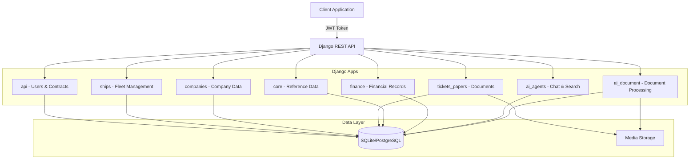
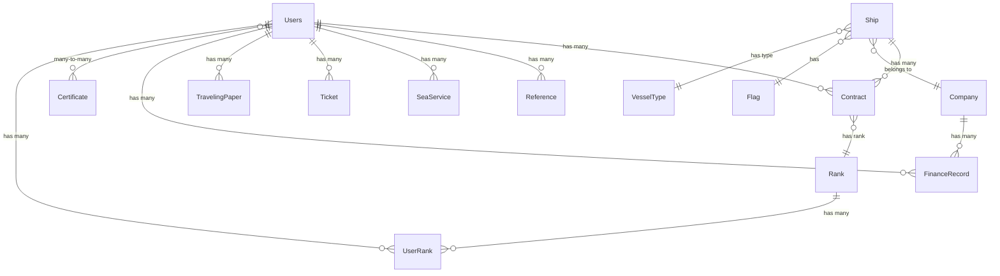

# 🚢 Manning Agency API Documentation


A comprehensive REST API for managing maritime manning agency operations, including seafarer management, ship assignments, employment contracts, and AI-powered document processing.

---

## 📋 Table of Contents

- [Overview](#overview)
- [Architecture](#architecture)
- [Authentication](#authentication)
- [API Endpoints](#api-endpoints)
  - [Authentication & Registration](#authentication--registration)
  - [Users Management](#users-management)
  - [Contracts](#contracts)
  - [Certificates & Ranks](#certificates--ranks)
  - [References & Sea Services](#references--sea-services)
  - [Ships](#ships)
  - [Companies](#companies)
  - [Tickets & Papers](#tickets--papers)
  - [Core Data](#core-data)
  - [Finance](#finance)
  - [AI Agents](#ai-agents)
  - [AI Document Processing](#ai-document-processing)
- [Data Models](#data-models)
- [Request/Response Examples](#requestresponse-examples)
- [Error Handling](#error-handling)

---

## 🎯 Overview

This Django REST Framework API provides a complete backend solution for maritime manning agencies to manage:

- **Seafarer Profiles**: Comprehensive user management with personal, professional, and medical information
- **Employment Contracts**: Track seafarer assignments to ships with contract details
- **Ship & Company Management**: Manage fleet and company information
- **Document Management**: Upload and manage tickets, traveling papers, and other documents
- **Finance Tracking**: Monitor work periods and calculate payments
- **AI-Powered Processing**: Automated document extraction and data mapping

### Technology Stack

- **Framework**: Django 5.2 + Django REST Framework 3.16.1
- **Authentication**: JWT (Simple JWT 5.5.1) with 15-day refresh token lifetime
- **Database**: SQLite (development) / PostgreSQL (production ready)
- **AI/ML**: LangChain, Ollama for document processing
- **Additional**: django-filter, django-multiselectfield

---

## 🏗️ Architecture



### Database Relationships



---

## 🔐 Authentication

The API uses **JWT (JSON Web Tokens)** for authentication with the following configuration:

- **Access Token**: Short-lived token for API requests
- **Refresh Token**: 15-day lifetime for obtaining new access tokens
- **Login Field**: Email (not username)

### Authentication Flow

1. **Register** a new account (public endpoint)
2. **Login** with email and password to receive tokens
3. **Include** access token in request headers
4. **Refresh** token when access token expires

### Token Usage

Include the access token in the `Authorization` header:

```http
Authorization: Bearer <your_access_token>
```

---

## 🔌 API Endpoints

Base URL: `http://127.0.0.1:8000` (development)

### Authentication & Registration

#### Register New User

- **Endpoint**: `POST /api/register/`
- **Authentication**: None (Public)
- **Description**: Create a new user account
- **Request Body**:

  ```json
  {
    "email": "seafarer@example.com",
    "password": "SecurePass123!",
    "first_name": "John"
  }
  ```

- **Response**: `201 Created`

  ```json
  {
    "id": 1,
    "email": "seafarer@example.com",
    "first_name": "John"
  }
  ```

#### Login

- **Endpoint**: `POST /api/login/`
- **Authentication**: None (Public)
- **Description**: Authenticate and receive JWT tokens
- **Request Body**:

  ```json
  {
    "email": "seafarer@example.com",
    "password": "SecurePass123!"
  }
  ```

- **Response**: `200 OK`

  ```json
  {
    "refresh": "eyJ0eXAiOiJKV1QiLCJhbGc...",
    "access": "eyJ0eXAiOiJKV1QiLCJhbGc..."
  }
  ```

#### Refresh Token

- **Endpoint**: `POST /api/login/refresh/`
- **Authentication**: None
- **Description**: Get new access token using refresh token
- **Request Body**:

  ```json
  {
    "refresh": "eyJ0eXAiOiJKV1QiLCJhbGc..."
  }
  ```

- **Response**: `200 OK`

  ```json
  {
    "access": "eyJ0eXAiOiJKV1QiLCJhbGc..."
  }
  ```

---

### Users Management

#### List All Users

- **Endpoint**: `GET /api/users/`
- **Authentication**: Required
- **Description**: Retrieve paginated list of all users
- **Query Parameters**:
  - `page`: Page number
  - `page_size`: Items per page
- **Response**: `200 OK`

#### Get Filtered Users

- **Endpoint**: `GET /api/filter/`
- **Authentication**: Required
- **Description**: Filter users by various criteria
- **Query Parameters**: (based on django-filter configuration)
  - `email`: Filter by email
  - `first_name`: Filter by first name
  - `nationality`: Filter by nationality
  - `user_status`: Filter by status (VECATION, ON_SITE, MEDICAL VECATION)
  - `marital_status`: Filter by marital status (SINGLE, MARRIED)

#### Get User Details

- **Endpoint**: `GET /api/users/<id>/`
- **Authentication**: Required
- **Description**: Retrieve detailed information for a specific user
- **Response**: `200 OK` (includes nested ranks, certificates, references, sea_services)

#### Create User

- **Endpoint**: `POST /api/users/`
- **Authentication**: Required
- **Description**: Create a new user with detailed information
- **Request Body**: (multipart/form-data for profile_image)

  ```json
  {
    "email": "captain@example.com",
    "first_name": "James",
    "middle_name": "Robert",
    "phone_number": "+1234567890",
    "nationality": "Egypt",
    "date_of_birth": "1985-05-15",
    "rank_ids": [1, 2],
    "certificate_ids": [5, 10, 15]
  }
  ```

#### Update User

- **Endpoint**: `PUT /api/users/<id>/` or `PATCH /api/users/<id>/`
- **Authentication**: Required
- **Description**: Update user information (full or partial)

#### Delete User

- **Endpoint**: `DELETE /api/users/<id>/`
- **Authentication**: Required
- **Description**: Delete a user account
- **Response**: `204 No Content`

#### User Certificates Management

##### Get User Certificates

- **Endpoint**: `GET /api/users/<user_id>/certificates/`
- **Authentication**: Required
- **Description**: List all certificates for a specific user

##### Add Certificate to User

- **Endpoint**: `POST /api/users/<user_id>/certificates/add/`
- **Authentication**: Required
- **Request Body**:

  ```json
  {
    "certificate_id": 5
  }
  ```

##### Remove Certificate from User

- **Endpoint**: `DELETE /api/users/<user_id>/certificates/<certificate_id>/remove/`
- **Authentication**: Required
- **Description**: Remove a certificate from user

#### User Ranks Management

##### Get User Ranks

- **Endpoint**: `GET /api/users/<user_id>/ranks/`
- **Authentication**: Required
- **Description**: List all ranks assigned to a user (includes assigned_code)

##### Add Rank to User

- **Endpoint**: `POST /api/users/<user_id>/ranks/add/`
- **Authentication**: Required
- **Request Body**:

  ```json
  {
    "rank_id": 3
  }
  ```

##### Assign Rank (Alternative)

- **Endpoint**: `POST /api/users/<user_id>/assign-rank/<rank_id>/`
- **Authentication**: Required
- **Description**: Assign a rank to user with auto-generated code

##### Remove Rank from User

- **Endpoint**: `DELETE /api/users/<user_id>/ranks/<rank_id>/remove/`
- **Authentication**: Required

---

### Contracts

Employment contracts track seafarer assignments to ships.

#### List Contracts

- **Endpoint**: `GET /api/contracts/`
- **Authentication**: Required
- **Description**: List all employment contracts
- **Response**: `200 OK`

  ```json
  [
    {
      "id": 1,
      "user": "seafarer@example.com",
      "ship": "MV Ocean Star (IMO1234567)",
      "rank": "DO-1.000 - Master",
      "sign_on_date": "2024-01-15",
      "sign_off_date": "2024-07-15",
      "salary": "5000.00",
      "status": "Active",
      "created_at": "2024-01-10T10:00:00Z",
      "updated_at": "2024-01-10T10:00:00Z"
    }
  ]
  ```

#### Create Contract

- **Endpoint**: `POST /api/contracts/`
- **Authentication**: Required
- **Request Body**:

  ```json
  {
    "user_id": 5,
    "ship_id": 3,
    "rank_id": 1,
    "sign_on_date": "2024-01-15",
    "sign_off_date": "2024-07-15",
    "salary": "5000.00",
    "status": "Active"
  }
  ```

#### Get Contract Details

- **Endpoint**: `GET /api/contracts/<id>/`
- **Authentication**: Required

#### Update Contract

- **Endpoint**: `PUT /api/contracts/<id>/` or `PATCH /api/contracts/<id>/`
- **Authentication**: Required

#### Delete Contract

- **Endpoint**: `DELETE /api/contracts/<id>/`
- **Authentication**: Required
- **Response**: `204 No Content`

---

### Certificates & Ranks

#### Certificates

##### List All Certificates

- **Endpoint**: `GET /api/certificates/`
- **Authentication**: Required
- **Description**: Get all available certificates
- **Response**: `200 OK`

  ```json
  [
    {
      "id": 1,
      "code": "PERSONAL_SURVIVAL_TECHNIQUES",
      "name": "Personal Survival Techniques"
    }
  ]
  ```

##### Create Certificate

- **Endpoint**: `POST /api/certificates/`
- **Authentication**: Required

##### Get/Update/Delete Certificate

- **Endpoints**: `GET/PUT/PATCH/DELETE /api/certificates/<id>/`
- **Authentication**: Required

#### Ranks

##### List All Ranks

- **Endpoint**: `GET /api/ranks/`
- **Authentication**: Required
- **Description**: Get all available ranks
- **Response**: `200 OK`

  ```json
  [
    {
      "id": 1,
      "code": "DO-1.000",
      "name": "Master"
    },
    {
      "id": 2,
      "code": "DO-2.000",
      "name": "1st. Officer – Chief Off."
    }
  ]
  ```

##### Create Rank

- **Endpoint**: `POST /api/ranks/`
- **Authentication**: Required

##### Get/Update/Delete Rank

- **Endpoints**: `GET/PUT/PATCH/DELETE /api/ranks/<id>/`
- **Authentication**: Required

---

### References & Sea Services

#### References

##### List References

- **Endpoint**: `GET /api/references/`
- **Authentication**: Required

##### Create Reference

- **Endpoint**: `POST /api/references/`
- **Authentication**: Required
- **Request Body**:

  ```json
  {
    "user": 5,
    "company_name": "Maritime Services Ltd",
    "position": "Chief Engineer",
    "name": "John Smith",
    "tel": "+1234567890",
    "email": "john.smith@maritime.com"
  }
  ```

##### Get/Update/Delete Reference

- **Endpoints**: `GET/PUT/PATCH/DELETE /api/references/<id>/`
- **Authentication**: Required

#### Sea Services

##### List Sea Services

- **Endpoint**: `GET /api/sea-services/`
- **Authentication**: Required

##### Create Sea Service

- **Endpoint**: `POST /api/sea-services/`
- **Authentication**: Required
- **Request Body**:

  ```json
  {
    "user": 5,
    "company_name": "Ocean Shipping Co.",
    "rank": "Second Officer",
    "vessel_name_imo": "MV Atlantic / IMO9876543",
    "flag": "Panama",
    "signed_on": "2022-01-15",
    "signed_off": "2022-07-15",
    "period": "6 months",
    "vessel_type": "Container Ship",
    "dwt_grt": "50000 DWT",
    "engine_type_bh_kw": "MAN B&W 12000 KW",
    "reason_for_sign_off": "End of contract"
  }
  ```

##### Get/Update/Delete Sea Service

- **Endpoints**: `GET/PUT/PATCH/DELETE /api/sea-services/<id>/`
- **Authentication**: Required

---

### Ships

#### List Ships

- **Endpoint**: `GET /api/ships/`
- **Authentication**: Required
- **Description**: Get all ships in the fleet
- **Response**: `200 OK`

  ```json
  [
    {
      "id": 1,
      "ship_name": "MV Ocean Star",
      "imo_number": "IMO1234567",
      "ship_type": "Container Ship",
      "flag": "Panama",
      "company": "Global Shipping Ltd",
      "status": "Active",
      "gross_tonnage": 50000,
      "deadweight": 70000,
      "year_built": 2015,
      "engine_power_kw": 12000
    }
  ]
  ```

#### Create Ship

- **Endpoint**: `POST /api/ships/`
- **Authentication**: Required
- **Request Body**:

  ```json
  {
    "ship_name": "MV Pacific Queen",
    "imo_number": "IMO7654321",
    "company": 2,
    "ship_type": 1,
    "flag": 3,
    "official_no": "OFF123456",
    "call_sign": "ABCD",
    "mmsi_no": "123456789",
    "port_of_registry": "Singapore",
    "gross_tonnage": 45000,
    "deadweight": 65000,
    "year_built": 2018,
    "builder": "Hyundai Heavy Industries",
    "engine_type": "MAN B&W",
    "engine_power_kw": 11000,
    "status": "Active"
  }
  ```

#### Get/Update/Delete Ship

- **Endpoints**: `GET/PUT/PATCH/DELETE /api/ships/<id>/`
- **Authentication**: Required

---

### Companies

#### List Companies

- **Endpoint**: `GET /api/companies/`
- **Authentication**: Required
- **Response**: `200 OK`

  ```json
  [
    {
      "id": 1,
      "company_name": "Global Shipping Ltd",
      "company_type": "Shipping",
      "open_positions": 5,
      "status": "Active",
      "contact_email": "hr@globalshipping.com",
      "hourly_rate": "25.00",
      "created_at": "2024-01-01T00:00:00Z"
    }
  ]
  ```

#### Create Company

- **Endpoint**: `POST /api/companies/`
- **Authentication**: Required
- **Request Body**:

  ```json
  {
    "company_name": "Pacific Maritime Services",
    "company_type": "Offshore",
    "open_positions": 10,
    "status": "Active",
    "contact_email": "contact@pacificmaritime.com",
    "hourly_rate": "30.00"
  }
  ```

#### Get/Update/Delete Company

- **Endpoints**: `GET/PUT/PATCH/DELETE /api/companies/<id>/`
- **Authentication**: Required

---

### Tickets & Papers

#### Tickets

##### List Tickets

- **Endpoint**: `GET /api/tickets-papers/tickets/`
- **Authentication**: Required
- **Description**: List all tickets (can filter by user)

##### Create Ticket

- **Endpoint**: `POST /api/tickets-papers/tickets/`
- **Authentication**: Required
- **Content-Type**: `multipart/form-data`
- **Request Body**:

  ```
  user: 5
  ticket_number: TKT-2024-001
  file: [binary file data]
  ```

##### Get/Update/Delete Ticket

- **Endpoints**: `GET/PUT/PATCH/DELETE /api/tickets-papers/tickets/<id>/`
- **Authentication**: Required

#### Traveling Papers

##### List Traveling Papers

- **Endpoint**: `GET /api/tickets-papers/traveling-papers/`
- **Authentication**: Required

##### Create Traveling Paper

- **Endpoint**: `POST /api/tickets-papers/traveling-papers/`
- **Authentication**: Required
- **Content-Type**: `multipart/form-data`
- **Request Body**:

  ```
  user: 5
  title: Visa Document
  issued_date: 2024-01-15
  file: [binary file data]
  ```

##### Get/Update/Delete Traveling Paper

- **Endpoints**: `GET/PUT/PATCH/DELETE /api/tickets-papers/traveling-papers/<id>/`
- **Authentication**: Required

---

### Core Data

Reference data for ships and other entities.

#### Flags

##### List Flags

- **Endpoint**: `GET /api/core/flags/`
- **Authentication**: Required
- **Description**: Get all country flags
- **Response**: `200 OK`

  ```json
  [
    {
      "id": 1,
      "name": "Panama",
      "icon": "/media/flags/panama.png"
    }
  ]
  ```

##### Create/Update/Delete Flag

- **Endpoints**: `POST/PUT/PATCH/DELETE /api/core/flags/` or `/api/core/flags/<id>/`
- **Authentication**: Required

#### Vessel Types

##### List Vessel Types

- **Endpoint**: `GET /api/core/vessel-types/`
- **Authentication**: Required
- **Description**: Get all vessel types
- **Response**: `200 OK`

  ```json
  [
    {
      "id": 1,
      "name": "Container Ship"
    },
    {
      "id": 2,
      "name": "Bulk Carrier"
    }
  ]
  ```

##### Create/Update/Delete Vessel Type

- **Endpoints**: `POST/PUT/PATCH/DELETE /api/core/vessel-types/` or `/api/core/vessel-types/<id>/`
- **Authentication**: Required

---

### Finance

#### List Finance Records

- **Endpoint**: `GET /api/finance/finance-records/`
- **Authentication**: Required
- **Description**: Get all financial records
- **Response**: `200 OK`

  ```json
  [
    {
      "id": 1,
      "user": 5,
      "company": 2,
      "start_date": "2024-01-01",
      "end_date": "2024-01-31",
      "total_days": 31,
      "daily_rate": "200.00",
      "total_money": "6200.00",
      "created_at": "2024-01-01T00:00:00Z"
    }
  ]
  ```

#### Create Finance Record

- **Endpoint**: `POST /api/finance/finance-records/`
- **Authentication**: Required
- **Request Body**:

  ```json
  {
    "user": 5,
    "company": 2,
    "start_date": "2024-02-01",
    "end_date": "2024-02-29"
  }
  ```

- **Note**: `total_days`, `daily_rate`, and `total_money` are calculated automatically

#### Get/Update/Delete Finance Record

- **Endpoints**: `GET/PUT/PATCH/DELETE /api/finance/finance-records/<id>/`
- **Authentication**: Required

---

### AI Agents

AI-powered chat and search functionality.

#### Chat Search

- **Endpoint**: `POST /ai-agents/chat/`
- **Authentication**: Required
- **Description**: Send a chat message and get AI-powered response
- **Request Body**:

  ```json
  {
    "message": "Find all masters available for assignment",
    "session_id": "optional-uuid-for-continuing-conversation"
  }
  ```

#### Chat History

- **Endpoint**: `GET /ai-agents/chat/history/<session_id>/`
- **Authentication**: Required
- **Description**: Retrieve chat history for a specific session

#### User Sessions

- **Endpoint**: `GET /ai-agents/chat/sessions/`
- **Authentication**: Required
- **Description**: List all chat sessions for the authenticated user

#### Search Capabilities

- **Endpoint**: `GET /ai-agents/capabilities/`
- **Authentication**: Required
- **Description**: Get information about available search capabilities

---

### AI Document Processing

Automated document extraction and data mapping to user profiles.

#### Upload Document

- **Endpoint**: `POST /ai/upload/`
- **Authentication**: Required
- **Content-Type**: `multipart/form-data`
- **Description**: Upload a document (CV, application form) for AI processing
- **Request Body**:

  ```
  document: [PDF/Image file]
  ```

- **Response**: `200 OK`

  ```json
  {
    "success": true,
    "applicant_id": 15,
    "user_id": 42,
    "message": "Document processed and data saved to both Applicant and Users models"
  }
  ```

- **What it does**:
  - Extracts data from uploaded document using AI
  - Saves to `Applicant` model (ai_document app)
  - Automatically maps and saves to `Users` model (api app)
  - Handles complex field mappings between different structures

#### List Applicants

- **Endpoint**: `GET /ai/applicants/`
- **Authentication**: Required
- **Description**: List all processed applicants

#### Get Applicant Details

- **Endpoint**: `GET /ai/applicants/<applicant_id>/`
- **Authentication**: Required
- **Description**: Get detailed information for a specific applicant

#### Update Applicant

- **Endpoint**: `PUT /ai/applicants/<applicant_id>/` or `PATCH /ai/applicants/<applicant_id>/`
- **Authentication**: Required

#### Delete Applicant

- **Endpoint**: `DELETE /ai/applicants/<applicant_id>/`
- **Authentication**: Required

#### Convert Applicant to User

- **Endpoint**: `POST /ai/convert/`
- **Authentication**: Required
- **Description**: Manually convert an applicant to a user
- **Request Body**:

  ```json
  {
    "applicant_id": 15
  }
  ```

#### Batch Convert Applicants

- **Endpoint**: `POST /ai/batch-convert/`
- **Authentication**: Required
- **Description**: Convert multiple applicants to users
- **Request Body**:

  ```json
  {
    "applicant_ids": [15, 16, 17]
  }
  ```

#### Check Sync Status

- **Endpoint**: `GET /ai/sync-status/`
- **Authentication**: Required
- **Description**: Check synchronization status between Applicant and Users models
- **Query Parameters**:
  - `applicant_id`: ID of applicant to check

---

## 📊 Data Models

### User Model

The `Users` model is the core of the system, extending Django's `AbstractBaseUser`.

**Key Fields**:

**Authentication & Basic Info**:

- `email` (EmailField, unique) - Login credential
- `first_name`, `middle_name` (CharField)
- `profile_image` (ImageField)

**Personal Information**:

- `age`, `date_of_birth`, `blood_type`
- `nationality`, `Place_Of_Birth`
- `marital_status` (SINGLE, MARRIED)
- `user_status` (VECATION, ON_SITE, MEDICAL VECATION)
- `Height_Cm`, `Weight_Kg`
- `smoker` (Boolean)

**Contact**:

- `address`, `phone_number`, `tel_number`

**Travel Documents**:

- Passport: `passport_no`, `passport_issue_date`, `passport_expiry_date`, `passport_issued_by`, `passport_place_of_issue`
- Seaman Book: `seaman_book_no`, `seaman_book_issue_date`, `seaman_book_expiry_date`, etc.
- Other Seaman Book: Similar fields with `other_` prefix

**Professional Qualifications**:

- COC Certificate: `coc_certificate_name`, `coc_certificate_number`, `coc_issue_date`, `coc_expiry_date`, `coc_issued_by`, `coc_issued_at`
- GOC Certificate: Similar fields with `goc_` prefix
- Marlins Test: `marlins_test_result`, `marlins_test_issued_date`, etc.

**Health & Medical**:

- Health Certificate: `health_flag_state`, `health_number`, `health_issue_date`, `health_expiry_date`
- International Medical: `international_medical_number`, dates
- Vaccinations: `yellow_fever_*`, `cholera_*`
- COVID-19: `covid_vaccine_name`, `covid_first_dose`, `covid_second_dose`, `covid_other_doses_or_remarks`

**Next of Kin**:

- `next_of_kin_full_name`, `next_of_kin_relationship`, `next_of_kin_address_country`, `next_of_kin_phone`, `next_of_kin_email`

**Additional Information**:

- Clothing sizes: `overall_size`, `shirt_size`, `trouser_size`, `shoes_size`
- Languages: `english_language_level`, `other_language`, `other_language_level`
- Medical history: `disease_history`, `accident_history`, `psychiatric_treatment_history`, `addiction_history`
- Declaration: `declaration_consent`, `declaration_date`, `declaration_place`
- Assessment: `initial_assessment_comments`, `responsible_person_name`, `assessment_date`

**Relationships**:

- `certificates` (ManyToMany with Certificate)
- `codes` (ManyToMany with Rank via UserRank)
- `contracts` (ForeignKey from Contract)
- `references` (ForeignKey from Reference)
- `sea_services` (ForeignKey from SeaService)
- `tickets` (ForeignKey from Ticket)
- `traveling_papers` (ForeignKey from TravelingPaper)

### Contract Model

Tracks employment assignments.

**Fields**:

- `user` (ForeignKey to Users)
- `ship` (ForeignKey to Ship)
- `rank` (ForeignKey to Rank)
- `sign_on_date`, `sign_off_date` (DateField)
- `salary` (DecimalField)
- `status` (Active, Completed, Pending)

### Ship Model

**Fields**:

- `ship_name`, `imo_number` (unique)
- `company` (ForeignKey to Company)
- `ship_type` (ForeignKey to VesselType)
- `flag` (ForeignKey to Flag)
- `official_no`, `call_sign`, `mmsi_no`, `port_of_registry`
- `gross_tonnage`, `deadweight`, `year_built`
- `builder`, `engine_type`, `engine_power_kw`
- `status` (Active, Under Maintenance, Inactive)
- `crew` (ManyToMany with Users)

### Company Model

**Fields**:

- `company_name` (unique)
- `company_type` (Shipping, Cruise, Cargo, Offshore, Other)
- `open_positions`, `status`, `contact_email`
- `hourly_rate` (DecimalField)

### Certificate Model

**Fields**:

- `code` (unique) - e.g., "PERSONAL_SURVIVAL_TECHNIQUES"
- `name` - Human-readable name

**Available Certificates** (102 types including):

- Personal Survival Techniques
- Fire Prevention and Fire Fighting
- GMDSS, ECDIS, ARPA
- Bridge/Engine Resource Management
- High Voltage Training
- Ship's Cook Certificate
- And many more...

### Rank Model

**Fields**:

- `code` (unique) - e.g., "DO-1.000"
- `name` - e.g., "Master"

**Available Ranks** (51 types):

- **Deck Officers**: Master, Chief Officer, 2nd Officer, 3rd Officer
- **Deck Ratings**: Boson, A.B, Steward, Cook, Carpenter
- **Engine Officers**: 1st Engineer, 2nd Engineer, 3rd Engineer, 4th Engineer, Electrical Engineer
- **Engine Ratings**: Electrician, Motor Man, Oiler, Fitter, Welder, Wiper

### UserRank Model

Links users to ranks with auto-generated sequential codes.

**Fields**:

- `user` (ForeignKey to Users)
- `rank` (ForeignKey to Rank)
- `assigned_code` (auto-generated, e.g., "DO-1.001", "DO-1.002")

### Reference Model

Professional references for seafarers.

**Fields**:

- `user`, `company_name`, `position`, `name`, `tel`, `email`

### SeaService Model

Previous employment history.

**Fields**:

- `user`, `company_name`, `rank`, `vessel_name_imo`
- `flag`, `signed_on`, `signed_off`, `period`
- `vessel_type`, `dwt_grt`, `engine_type_bh_kw`
- `reason_for_sign_off`

### Ticket & TravelingPaper Models

Document management.

**Ticket**:

- `user`, `ticket_number`, `file`, `created_at`

**TravelingPaper**:

- `user`, `title`, `issued_date`, `file`, `created_at`

### FinanceRecord Model

Financial tracking with automatic calculations.

**Fields**:

- `user`, `company`, `start_date`, `end_date`

**Calculated Properties**:

- `total_days`: Days between start and end
- `daily_rate`: Company hourly_rate × 8 hours
- `total_money`: total_days × daily_rate

### Flag & VesselType Models

Reference data for ships.

**Flag**:

- `name`, `icon` (ImageField)

**VesselType**:

- `name` (e.g., "Container Ship", "Bulk Carrier")

---

## 📝 Request/Response Examples

### Example 1: Complete User Registration and Setup

```bash
# 1. Register new user
curl -X POST http://127.0.0.1:8000/api/register/ \
  -H "Content-Type: application/json" \
  -d '{
    "email": "captain.smith@maritime.com",
    "password": "SecurePass123!",
    "first_name": "James"
  }'

# 2. Login to get tokens
curl -X POST http://127.0.0.1:8000/api/login/ \
  -H "Content-Type: application/json" \
  -d '{
    "email": "captain.smith@maritime.com",
    "password": "SecurePass123!"
  }'

# Response:
{
  "refresh": "eyJ0eXAiOiJKV1QiLCJhbGc...",
  "access": "eyJ0eXAiOiJKV1QiLCJhbGc..."
}

# 3. Update user profile with detailed information
curl -X PATCH http://127.0.0.1:8000/api/users/1/ \
  -H "Authorization: Bearer <access_token>" \
  -H "Content-Type: application/json" \
  -d '{
    "middle_name": "Robert",
    "phone_number": "+20123456789",
    "nationality": "Egypt",
    "date_of_birth": "1980-05-15",
    "passport_no": "A12345678",
    "passport_issue_date": "2020-01-01",
    "passport_expiry_date": "2030-01-01",
    "passport_issued_by": "Egyptian Government",
    "marital_status": "MARRIED",
    "user_status": "ON_SITE"
  }'

# 4. Add certificates to user
curl -X POST http://127.0.0.1:8000/api/users/1/certificates/add/ \
  -H "Authorization: Bearer <access_token>" \
  -H "Content-Type: application/json" \
  -d '{"certificate_id": 1}'

# 5. Assign rank to user
curl -X POST http://127.0.0.1:8000/api/users/1/assign-rank/1/ \
  -H "Authorization: Bearer <access_token>"
```

### Example 2: Create Employment Contract

```bash
# 1. Create a contract
curl -X POST http://127.0.0.1:8000/api/contracts/ \
  -H "Authorization: Bearer <access_token>" \
  -H "Content-Type: application/json" \
  -d '{
    "user_id": 1,
    "ship_id": 5,
    "rank_id": 1,
    "sign_on_date": "2024-01-15",
    "sign_off_date": "2024-07-15",
    "salary": "5000.00",
    "status": "Active"
  }'

# Response:
{
  "id": 10,
  "user": "captain.smith@maritime.com",
  "ship": "MV Ocean Star (IMO1234567)",
  "rank": "DO-1.000 - Master",
  "sign_on_date": "2024-01-15",
  "sign_off_date": "2024-07-15",
  "salary": "5000.00",
  "status": "Active",
  "created_at": "2024-01-10T10:00:00Z",
  "updated_at": "2024-01-10T10:00:00Z"
}
```

### Example 3: Upload Documents

```bash
# Upload a ticket
curl -X POST http://127.0.0.1:8000/api/tickets-papers/tickets/ \
  -H "Authorization: Bearer <access_token>" \
  -F "user=1" \
  -F "ticket_number=TKT-2024-001" \
  -F "file=@/path/to/ticket.pdf"

# Upload traveling paper
curl -X POST http://127.0.0.1:8000/api/tickets-papers/traveling-papers/ \
  -H "Authorization: Bearer <access_token>" \
  -F "user=1" \
  -F "title=US Visa" \
  -F "issued_date=2024-01-15" \
  -F "file=@/path/to/visa.pdf"
```

### Example 4: AI Document Processing

```bash
# Upload CV for automatic processing
curl -X POST http://127.0.0.1:8000/ai/upload/ \
  -H "Authorization: Bearer <access_token>" \
  -F "document=@/path/to/seafarer_cv.pdf"

# Response:
{
  "success": true,
  "applicant_id": 25,
  "user_id": 50,
  "message": "Document processed successfully",
  "extracted_data": {
    "first_name": "John",
    "email": "john.doe@example.com",
    "nationality": "Philippines",
    "certificates": ["STCW Basic Safety", "GMDSS"],
    "rank": "Second Officer"
  }
}
```

### Example 5: Finance Tracking

```bash
# Create finance record
curl -X POST http://127.0.0.1:8000/api/finance/finance-records/ \
  -H "Authorization: Bearer <access_token>" \
  -H "Content-Type: application/json" \
  -d '{
    "user": 1,
    "company": 2,
    "start_date": "2024-01-01",
    "end_date": "2024-01-31"
  }'

# Response (with calculated fields):
{
  "id": 5,
  "user": 1,
  "company": 2,
  "start_date": "2024-01-01",
  "end_date": "2024-01-31",
  "total_days": 31,
  "daily_rate": "200.00",
  "total_money": "6200.00",
  "created_at": "2024-01-15T10:00:00Z"
}
```

---

## ⚠️ Error Handling

The API uses standard HTTP status codes:

### Success Codes

- `200 OK`: Request succeeded
- `201 Created`: Resource created successfully
- `204 No Content`: Resource deleted successfully

### Client Error Codes

- `400 Bad Request`: Invalid request data

  ```json
  {
    "email": ["This field is required."],
    "password": ["This field may not be blank."]
  }
  ```

- `401 Unauthorized`: Missing or invalid authentication

  ```json
  {
    "detail": "Authentication credentials were not provided."
  }
  ```

- `403 Forbidden`: Insufficient permissions

  ```json
  {
    "detail": "You do not have permission to perform this action."
  }
  ```

- `404 Not Found`: Resource not found

  ```json
  {
    "detail": "Not found."
  }
  ```

- `409 Conflict`: Resource conflict (e.g., duplicate email)

  ```json
  {
    "email": ["This email is already registered."]
  }
  ```

### Server Error Codes

- `500 Internal Server Error`: Server-side error

  ```json
  {
    "detail": "An error occurred processing your request."
  }
  ```

### JWT Token Errors

**Expired Token**:

```json
{
  "detail": "Given token not valid for any token type",
  "code": "token_not_valid",
  "messages": [
    {
      "token_class": "AccessToken",
      "token_type": "access",
      "message": "Token is expired"
    }
  ]
}
```

**Solution**: Use refresh token to get new access token

**Invalid Token**:

```json
{
  "detail": "Token is invalid or expired",
  "code": "token_not_valid"
}
```

---

## 🚀 Getting Started

### Prerequisites

- Python 3.8+
- pip
- Virtual environment (recommended)

### Installation

```bash
# 1. Clone the repository
git clone <repository-url>
cd django-test

# 2. Create virtual environment
python -m venv venv
source venv/bin/activate  # On Windows: venv\Scripts\activate

# 3. Install dependencies
pip install -r requirements.txt

# 4. Run migrations
python manage.py makemigrations
python manage.py migrate

# 5. Create superuser
python manage.py createsuperuser
# Note: Use email as login field

# 6. Run development server
python manage.py runserver
```

### Access Points

- **API Base**: <http://127.0.0.1:8000/api/>
- **Admin Panel**: <http://127.0.0.1:8000/admin/>
- **API Documentation**: This file

---

## 📚 Additional Resources

### Django Admin

The project includes a comprehensive Django Admin interface for managing:

- Users with detailed inline forms
- Ships and Companies
- Contracts and Finance Records
- Certificates and Ranks
- Documents (Tickets & Papers)
- AI-processed Applicants

Access at: <http://127.0.0.1:8000/admin/>

### Filtering

The API supports filtering on various endpoints using django-filter:

```bash
# Filter users by nationality
GET /api/filter/?nationality=Egypt

# Filter by multiple criteria
GET /api/filter/?nationality=Egypt&user_status=ON_SITE&marital_status=SINGLE
```

### Pagination

List endpoints support pagination:

```bash
# Get second page with 20 items per page
GET /api/users/?page=2&page_size=20
```

### File Uploads

When uploading files (profile images, documents):

- Use `multipart/form-data` content type
- Files are stored in `media/` directory
- Supported formats: PDF, images (JPEG, PNG), documents

---

## 🔒 Security Notes

1. **JWT Tokens**:
   - Access tokens are short-lived
   - Refresh tokens expire after 15 days
   - Store tokens securely (never in localStorage for production)

2. **HTTPS**:
   - Always use HTTPS in production
   - Configure `SECURE_SSL_REDIRECT = True` in settings

3. **CORS**:
   - Configure allowed origins in production
   - Don't use `CORS_ALLOW_ALL_ORIGINS = True` in production

4. **File Uploads**:
   - Validate file types and sizes
   - Scan uploaded files for malware in production

5. **Rate Limiting**:
   - Consider implementing rate limiting for production
   - Especially for authentication endpoints

---

## 📞 Support

For issues, questions, or contributions:

- Check existing documentation
- Review Django REST Framework documentation
- Contact the development team

---

## 📄 License

[Specify your license here]

---

**Last Updated**: November 2024  
**API Version**: 1.0  
**Django Version**: 5.2  
**DRF Version**: 3.16.1
