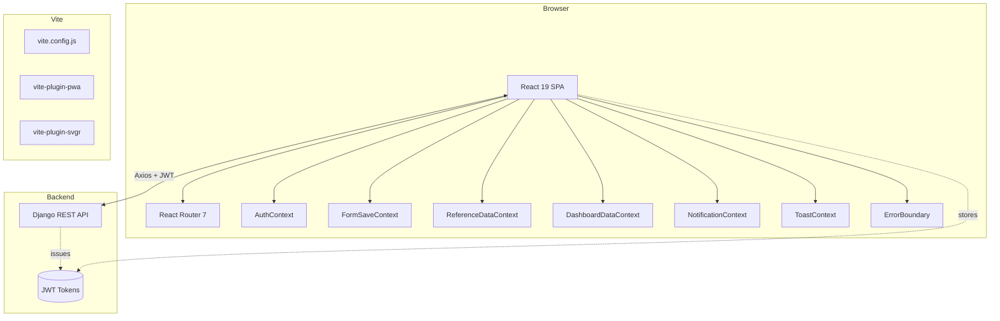
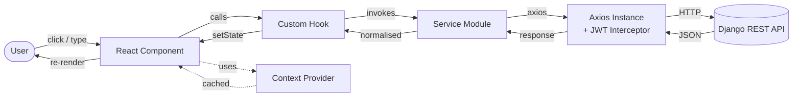
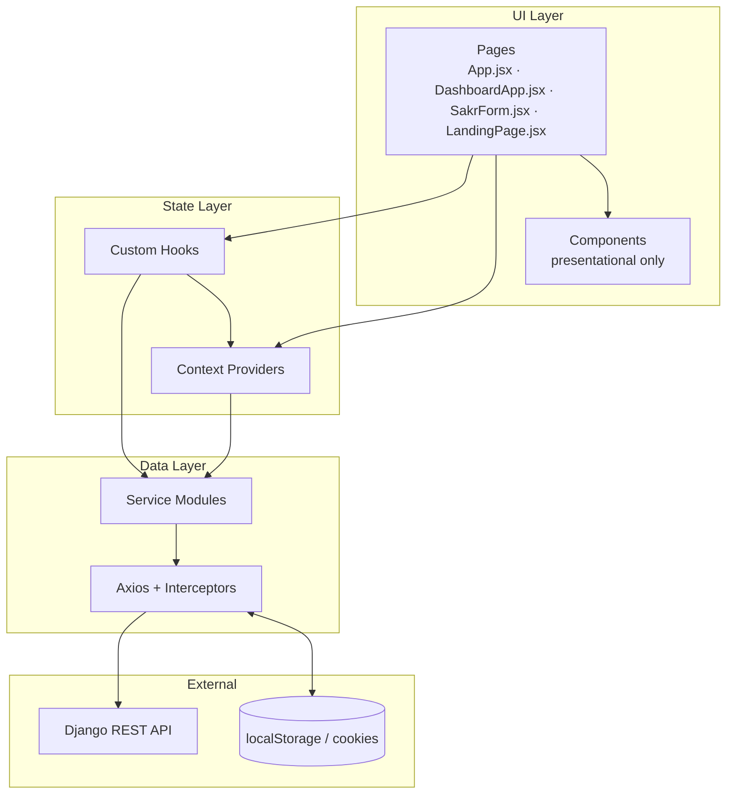
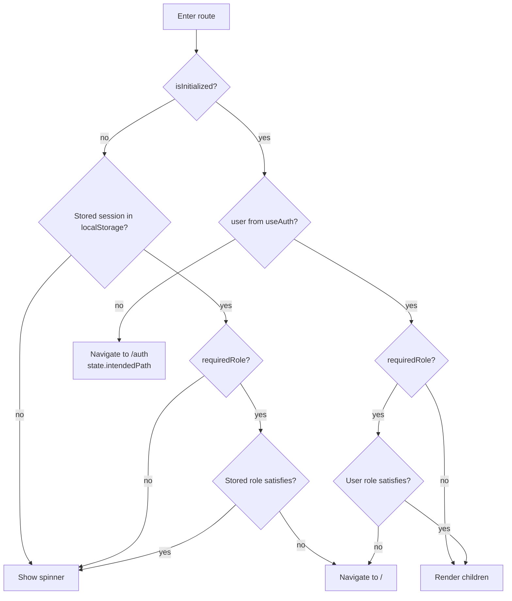
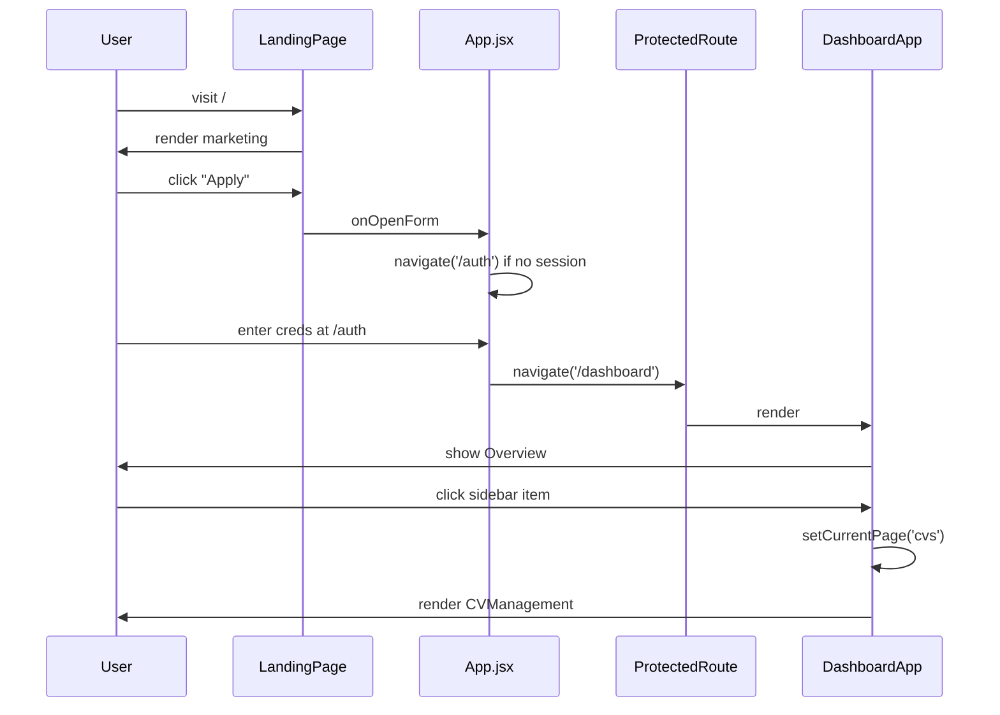
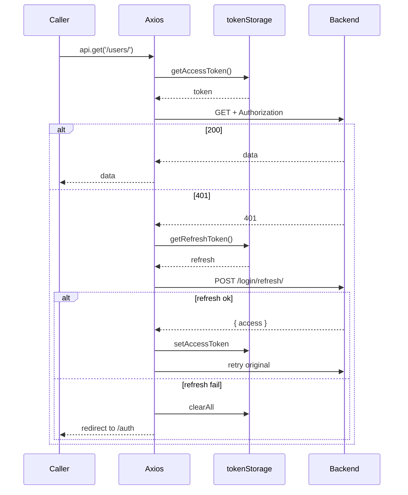
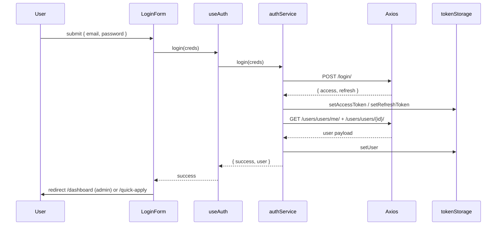
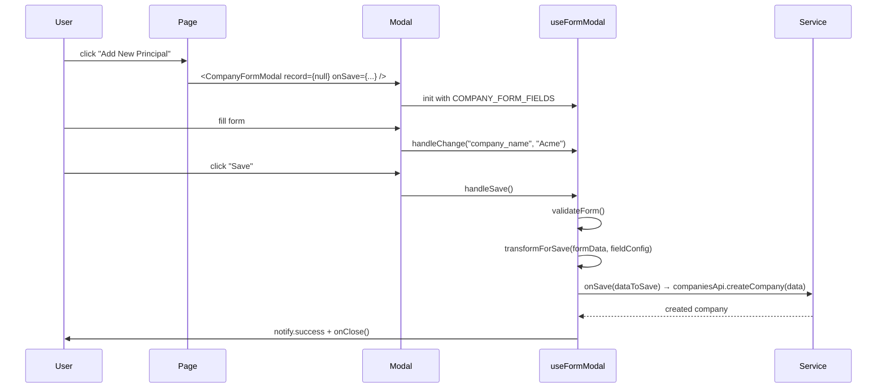
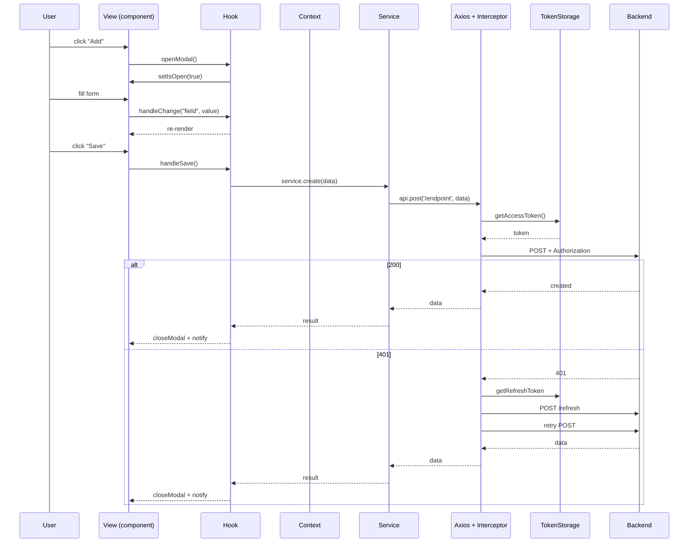
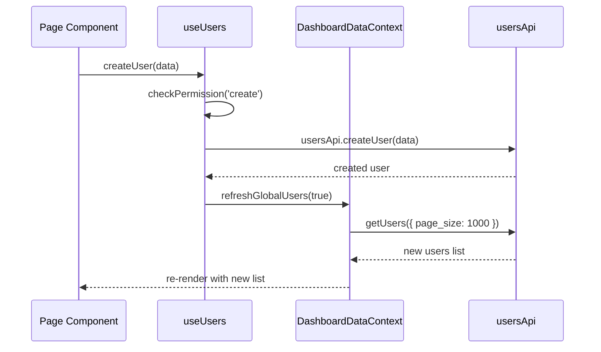

# Sakr Manning Agency — Frontend Documentation

> **Source root:** `E:\2-TECHNO AQUARE\Sakr-Manning-Agency-Frontend`
> **Stack:** React 19 + Vite 7 + React Router 7 + Tailwind 3 + GSAP + Recharts
> **Status as of:** 2026-07-13 (this commit)
> **Audience:** new developers who need to maintain or extend the application.

---

## Table of Contents

1. [Project Overview](#1-project-overview)
2. [Technology Stack](#2-technology-stack)
3. [Project Structure](#3-project-structure)
4. [Application Architecture](#4-application-architecture)
5. [Routing](#5-routing)
6. [State Management](#6-state-management)
7. [API Layer](#7-api-layer)
8. [Authentication & Authorization](#8-authentication--authorization)
9. [Components](#9-components)
10. [Custom Hooks](#10-custom-hooks)
11. [Context Providers](#11-context-providers)
12. [Utilities](#12-utilities)
13. [Services](#13-services)
14. [Forms](#14-forms)
15. [Styling](#15-styling)
16. [Environment Variables](#16-environment-variables)
17. [Configuration Files](#17-configuration-files)
18. [Error Handling](#18-error-handling)
19. [Performance Optimizations](#19-performance-optimizations)
20. [Security](#20-security)
21. [Build & Deployment](#21-build--deployment)
22. [Testing](#22-testing)
23. [Dependencies](#23-dependencies)
24. [Code Quality Review](#24-code-quality-review)
25. [Feature Walkthrough](#25-feature-walkthrough)
26. [Data Flow](#26-data-flow)
27. [Known Issues](#27-known-issues)
28. [Developer Guide](#28-developer-guide)
29. [Appendix](#29-appendix)

---

# 1. Project Overview

## 1.1 Purpose

Sakr Manning Agency is a single-page React application that serves three distinct audiences from one bundle:

1. **Anonymous visitors** browsing the public marketing site (Home, About, Services, Contact).
2. **Aspiring seafarers** submitting a CV/quick-apply or filling out a multi-step Seafarer Application Form (used to populate a mariner profile with personal, education, sea-service, health, and document data).
3. **Internal admin staff** operating a maritime-crew-management dashboard (Applicants, Principals & Vessels, Job Vacancies, Interviews, Contracts, Crew Management, Users, Finance, AI Assistant, and Search).

The frontend talks to a Django REST Framework backend. Authentication is JWT-based, with two tokens (access + refresh) and an axios interceptor that auto-refreshes the access token on 401.

## 1.2 Business Domain

Maritime crew management / manning agency. The product digitises the lifecycle of a seafarer:

- **Capture** — Seafarer Application Form with 12 steps, document uploads, file/photo attachments.
- **Pool** — Applicants (CVs) and Users (operators) live in two related tables.
- **Match** — Job Vacancies from Principals (companies / ship owners) are matched to Applicants.
- **Engage** — Interviews are scheduled; Contracts are generated as PDFs (`@react-pdf/renderer`).
- **Monitor** — Document expiry (passports, sea-books, licenses, vaccinations, contracts) drives alerts.
- **Bill** — Finance records per user / principal / ship.
- **AI assist** — Bulk import of CVs (PDF/DOCX) and a chat widget powered by Groq/Gemini.

## 1.3 Primary Features

| # | Feature | Where it lives |
| - | --- | --- |
| 1 | Public marketing site (4 pages) | `src/components/landing/pages/` |
| 2 | Quick-Apply (single-page CV submission) | `src/components/landing/QuickApply.jsx` |
| 3 | Notify page (status guard: Pending / Blacklist) | `src/components/landing/NotifyPage.jsx` |
| 4 | 12-step Seafarer Application Form | `src/components/form/SakrForm.jsx` |
| 5 | Admin Dashboard (10 pages) | `src/components/dashboard/Content/*` |
| 6 | Data tables with filter / sort / search / bulk actions | `src/components/dashboard/Components/Data/*` |
| 7 | CRUD modals (Company, Ship, User, Interview, Finance…) | `src/components/dashboard/Components/Modal/*` |
| 8 | Dashboard charts (Recharts: pie, line) | `src/components/dashboard/Components/Charts/*` |
| 9 | Document-expiry notifications | `src/hooks/dashboard/useDocumentExpiry.js` + `Header.jsx` |
| 10 | Global search (full-text backend) | `src/services/Dashboard/globalSearchApi.js` + `Header.jsx` |
| 11 | AI Chat widget (Groq/Gemini via backend) | `src/components/dashboard/Components/AI/ChatWidget.jsx` |
| 12 | Bulk CV import (PDF/DOCX) | `src/components/dashboard/Components/AI/BulkImport.jsx` |
| 13 | PDF generation (Contracts, CV exports) | `src/utils/contractPdfGenerator.jsx`, `src/utils/pdfReportGenerator.jsx`, `src/utils/dashboard/brandedCVGenerator.jsx`, `src/components/dashboard/Components/AI/CompactCVEditForm.jsx` |
| 14 | PWA support | `vite-plugin-pwa` (manifest + workbox runtime caching) |
| 15 | Dark mode + zoomable dashboard | `DashboardApp.jsx` (`isDarkMode`, `zoomLevel` state) |

## 1.4 Intended Users

- **Visitors** (no auth) — browse marketing, Quick-Apply.
- **Applicants / Seafarers** (auth required) — fill / resume the Seafarer Application Form.
- **Admins** (auth + `role == "admin"`) — access `/dashboard` and all CRUD pages.
- **HR Manager / Recruiter** (auth + role) — read-only access (`usePermissions.js`).
- **Blacklisted / Pending applicants** — redirected to `/notify` from any auth-gated page.

## 1.5 Overall Architecture



The application is a classic three-tier SPA:

- **Presentation:** React + Tailwind utility classes, augmented by GSAP timelines and Recharts.
- **State:** a mix of Context API (for app-wide state) and local `useState`/`useReducer` (for page-level state). **No Redux.**
- **Data access:** thin service modules (`src/services/*Api.js`) wrap a single shared axios instance with JWT, refresh, and error handling baked in.

---

# 2. Technology Stack

| Layer | Library | Why it is used | Pin (`package.json`) |
| --- | --- | --- | --- |
| Framework | **React 19** | UI runtime; concurrent rendering for smooth sidebar/zoom transitions. | `^19.1.1` |
| Build | **Vite 7** | Sub-second HMR, native ESM dev server. | `^7.1.2` |
| Routing | **react-router-dom 7** | Declarative routing + nested layouts. | `^7.8.2` |
| Styling | **Tailwind CSS 3** | Utility-first; tight design system (`maritime-*` palette). | `^3.4.0` |
| Animations | **GSAP 3 + @gsap/react** | Timeline-based entrance animations on dashboard/sidebar/overview. | `^3.15.0` / `^2.1.2` |
| Animations | **framer-motion 12** | Decorative micro-animations. | `^12.23.12` |
| Charts | **Recharts 3** | Pie/line charts on Overview. | `^3.8.1` |
| Calendar | **react-big-calendar 1** | Interview calendar view. | `^1.20.0` |
| Sliders | **keen-slider** + **react-slick** + **slick-carousel** | Landing-page hero/slider. | `^6.8.6` / `^0.31.0` / `^1.8.1` |
| Forms | **react-hook-form** + **@hookform/resolvers** + **yup** | SakrForm (12-step). Resolvers present but Yup schema not actually wired — see [§24](#24-code-quality-review). | `^5.2.1` / `^1.7.0` |
| HTTP | **axios 1** | Request/response interceptors for JWT. | `^1.11.0` |
| Tokens | **jwt-decode 4** | Decoding access tokens for expiry checks. | `^4.0.0` |
| Dates | **date-fns 4** | ISO date conversion in `formMapper.js`. | `^4.1.0` |
| Phones | **libphonenumber-js 1** | Country code parsing for mobile / next-of-kin. | `^1.12.22` |
| PDF | **@react-pdf/renderer 4** | Contract / CV PDFs. | `^4.5.1` |
| Icons | **lucide-react** | Modern, tree-shakable SVG icons. | `^0.541.0` |
| Spreadsheet parsing | **xlsx 0.18.5** | Optional bulk-import in dashboard. | `^0.18.5` |
| Lint | **ESLint 9** (`@eslint/js` + `eslint-plugin-react-hooks` + `eslint-plugin-react-refresh`) | Hook & HMR-safe lint. | `^9.33.0` |
| E2E | **@playwright/test 1.61** + **puppeteer 25** | Test runners (Playwright config present; see `playwright.config.js`/`playwright.config.ts`). | `^1.61.0` / `^25.2.0` |
| PWA | **vite-plugin-pwa 1.3** | Service worker + manifest. | `^1.3.0` |
| SVG-as-React | **vite-plugin-svgr 4.5** | Import `.svg` files as React components (`form-icons/`). | `^4.5.0` |
| CSS helpers | **@tailwindcss/forms** | Reset form controls. | `^0.5.10` |
| CSS preflight | **postcss 8** + **autoprefixer 10** | Tailwind pipeline. | `^8.5.6` / `^10.4.21` |

> **No Redux / Zustand / MobX / Recoil / React Query / TanStack Query.** All server state lives in the `DashboardDataContext` cache and per-page `useState`. This is a deliberate (or under-evolved) choice — see [§24.4](#244-duplicated-state-management).

> **TypeScript is not used** despite `@types/node`, `@types/react`, and `@types/react-dom` being installed. Everything is `.js` / `.jsx`.

---

# 3. Project Structure

```
Sakr-Manning-Agency-Frontend/
├── Documentation.jsx          # (file at root, appears to be a stray JSX doc)
├── check_*.cjs                # ad-hoc Node check scripts (axios, console)
├── eslint.config.js
├── find_matches.py / *.py     # Python utilities (one-off, ignore)
├── index.html
├── package.json
├── patch.diff                  # large patch artefact
├── playwright.config.{js,ts}   # Playwright config
├── postcss.config.js
├── public/                     # static assets (PWA icons etc.)
├── src/
│   ├── App.jsx                 # Router + auth/dashboard/form wrappers
│   ├── ErrorBoundary.jsx       # class component error boundary
│   ├── main.jsx                # React root; wraps ErrorBoundary + Auth + Notification
│   ├── _archive/               # deprecated components (see §24.3)
│   ├── assets/                 # images, icons, form-icons (SVGs)
│   ├── components/
│   │   ├── auth/               # LoginForm, SignUpForm, VerificationCode, GoogleLoginButton
│   │   ├── common/             # Button, Card, Input, Modal, Pagination, … (also legacy)
│   │   ├── dashboard/
│   │   │   ├── Components/
│   │   │   │   ├── AI/         # ChatWidget, BulkImport, ApiKeysManager, DocumentUploadModal, …
│   │   │   │   ├── Cards/      # StatCard, DocumentCard, InfoCard, …
│   │   │   │   ├── Charts/     # CVStatusChart, InterviewTrendChart, RegistrationTrendChart
│   │   │   │   ├── Common/     # Button, LoadingScreen, NotificationCenter, FormModal, …
│   │   │   │   ├── Data/       # DataTable, RefinedDataTable, AdvancedDataTable, Pagination, …
│   │   │   │   ├── inputs/     # BaseInput, DateInput, MultiSelect, PhoneInput, Select, TypeaheadInput
│   │   │   │   ├── Modal/      # CompanyFormModal, CVFormModal, UserFormModal, … + ViewModal/*
│   │   │   │   └── PDF/        # SeafarerApplicationPDF
│   │   │   ├── config/         # formConfigs.js
│   │   │   ├── Content/        # page-level views: Overview, CV, Company, Interviews, …
│   │   │   ├── context/        # DashboardDataContext, NotificationContext, SearchContext
│   │   │   ├── hooks/          # useFormModal, useFormValidation, useSearch, useTableFilters, …
│   │   │   ├── Styles/         # componentStyles.js, cssClasses.js, globalStyles.js
│   │   │   ├── Constants.jsx
│   │   │   ├── DashboardApp.jsx
│   │   │   ├── Header.jsx
│   │   │   └── Sidebar.jsx
│   │   ├── form/
│   │   │   ├── inputs/         # BaseInput, Checkbox, DateInput, DynamicFieldArray, FileUpload, …
│   │   │   ├── layout/         # FormHeader, FormNavigation, FormTable, Sidebar, StepSaveButton
│   │   │   ├── modals/         # CertificateModal, CourseModal, DocumentModal, HealthModal, …
│   │   │   ├── steps/          # 12 step components (PositionPersonal, Education, …, Submit)
│   │   │   └── SakrForm.jsx
│   │   ├── landing/
│   │   │   ├── layout/         # Header, Footer
│   │   │   ├── pages/          # HomePage, AboutPage, ServicesPage, ContactPage
│   │   │   ├── LandingPage.jsx
│   │   │   ├── NotifyPage.jsx
│   │   │   └── QuickApply.jsx
│   │   └── layout/             # AuthLayout, Background, ProtectedRoute, index
│   ├── config/                 # formConfig.js (FORM_FIELDS), modalValidation.js
│   ├── context/                # AuthContext, FormSaveContext, ReferenceDataContext, ToastContext
│   ├── hooks/
│   │   ├── dashboard/          # useAI, useCompanies, useCVDocuments, useCVSubmissions, useDocumentExpiry, useDocuments, useFinance, useInterviews, useJobOrders, useJobPositions, usePermissions, useQuickApply, useRanks, useShips, useUsers, useVacancies
│   │   ├── useApplicationStatus.js
│   │   ├── useAuth.js
│   │   ├── useCrudManager.js
│   │   ├── useDashboardData.js  # barrel only
│   │   ├── useForm.js
│   │   ├── useFormField.js
│   │   ├── useReferenceData.js
│   │   ├── useSaveLock.js
│   │   └── useUserForm.js
│   ├── services/
│   │   ├── Auth/                # api.js (axios instance), authServices.js, config.js, handlers.js, helpers.js, tokenStorage.js
│   │   ├── Dashboard/           # 12 thin API modules (usersApi, companiesApi, shipsApi, …)
│   │   └── Form/                # 9 service modules used by the Seafarer form (userService, seaServiceService, …)
│   ├── styles/                  # globals.css, index.css
│   └── utils/
│       ├── constants.js
│       ├── validation.js
│       ├── newValidation.js
│       ├── formMapper.js
│       ├── formHelpers.js
│       ├── formDataProcessor.js
│       ├── formCompletionChecker.js
│       ├── fileUpload.js
│       ├── fileHelpers.js
│       ├── exportHelpers.js
│       ├── draftUtils.js
│       ├── dashboardMappings.js
│       ├── RHFvalidationRules.js
│       ├── contractPdfGenerator.jsx
│       ├── pdfReportGenerator.jsx
│       └── dashboard/
│           ├── formValidation.js
│           ├── formatters.js
│           ├── fieldConfigs.js   # 1698 lines: every dashboard form's field config
│           ├── brandedCVGenerator.jsx
│           └── dateHelpers.js
├── tests/                       # (folder exists; no test files discovered)
├── update_sidebar.py            # one-off Python helpers at root
├── vercel.json
└── vite.config.js
```

## 3.1 Responsibility by folder

| Folder | Responsibility |
| --- | --- |
| `src/assets/` | Static images/icons bundled by Vite. SVGs imported via `?react` use `vite-plugin-svgr`. |
| `src/components/auth/` | Auth UI: `LoginForm`, `SignUpForm`, `VerificationCode`, `GoogleLoginButton`. Pulled in by `App.jsx` `AuthPages` wrapper. |
| `src/components/common/` | **Mixed.** Some are still in use (e.g. `Pagination.jsx`), some are stubs/legacy (e.g. `Button.jsx` is *unused* in favour of the new `Components/Common/Button.jsx`). |
| `src/components/dashboard/` | The admin shell: `DashboardApp` (router-of-routes), `Header`, `Sidebar`, plus 10 page-level `Content/*` views and all the building blocks. |
| `src/components/form/` | The Seafarer 12-step form: each step is its own `steps/*.jsx`; modals under `modals/` open for array fields; inputs under `inputs/`. |
| `src/components/landing/` | Marketing site + `QuickApply` + `NotifyPage`. |
| `src/components/layout/` | `AuthLayout`, `Background`, `ProtectedRoute`, `index` (barrel). |
| `src/_archive/` | **Deprecated** components kept for reference (e.g. `ui/Button`, `ui/Input`). They are still imported by `LoginForm` / `SignUpForm` but the new dashboard uses different paths. |
| `src/config/` | App-wide static config: `formConfig.js` (label/dropdown constants), `modalValidation.js`. |
| `src/context/` | React Context providers — see [§11](#11-context-providers). |
| `src/hooks/` | Custom hooks — see [§10](#10-custom-hooks). |
| `src/services/` | API service modules — see [§13](#13-services). |
| `src/styles/` | Global CSS (Tailwind layers, custom keyframes). |
| `src/utils/` | Pure functions (formatters, validation, date helpers, draft cleanup) and the **mappers** that translate the snake_case backend into the camelCase frontend. |
| `public/` | PWA icons, manifest fragments. |

---

# 4. Application Architecture

## 4.1 Architectural style

**Feature-based hybrid** with a **layered** internal split. Each feature folder (e.g. `dashboard`, `form`, `auth`, `landing`) is self-contained: components, hooks, services and styling for that feature live together. Internally, the data-flow pattern is **MVC-ish** — Views (components) call Controllers (hooks), Controllers call Service modules, which hit the Backend.

## 4.2 Data flow (high level)



## 4.3 Component composition rules

1. **Pages wrap their own data hooks.** A `Content/*.jsx` page (e.g. `Company.jsx`) directly calls `useCompanies()`, `useShips()`, etc. It does not receive data via props from the shell.
2. **Shell state lives in `DashboardApp.jsx`:** `currentPage`, `isDarkMode`, `zoomLevel`, `mobileMenuOpen`, `isSettingsOpen`, search query/results, `navItemData`. Child pages receive `onNavigate` and a few common props (`scale`, `isMobile`).
3. **Form modals all share `useFormModal`** ([§10.6](#106-useformmodal--componentformodalshared-behavior)). The hook is the single place that owns form-data, errors, dirty-state, save.
4. **Service modules never call hooks.** They are plain JS objects of async functions. They only import `api` from `services/Auth/api.js`.

## 4.4 Layer diagram



---

# 5. Routing

## 5.1 Library

`react-router-dom 7.8.2` with `BrowserRouter`. Routes are defined in `src/App.jsx`.

## 5.2 Route table

| Path | Component | Auth | Role | Source |
| --- | --- | --- | --- | --- |
| `/` | `<Landing/>` (`LandingPage`) | optional | any | `App.jsx:300` |
| `/auth` | `<AuthPages/>` | optional (auto-redirects if logged in) | any | `App.jsx:303` |
| `/dashboard` | `<Dashboard/>` (`DashboardApp`) | required | admin | `App.jsx:307` |
| `/form` | `<FormPage/>` (`SakrForm`) | required | any auth user | `App.jsx:317` |
| `/quick-apply` | `<QuickApply/>` | required (status-guard inside) | non-admin or any | `App.jsx:327` |
| `/notify` | `<NotifyPage/>` | required | any (shown for pending / blacklisted) | `App.jsx:333` |
| `*` | `<Navigate to="/" replace/>` | – | – | `App.jsx:338` |

> ⚠️ The "Dashboard" sub-routes (`cvs`, `management`, `interviews`, etc.) are **not** React Router routes. They are page-state inside `DashboardApp` — see [§25.5](#255-dashboard-internal-navigation) for the implications.

## 5.3 Protected routes

`src/components/layout/ProtectedRoute.jsx`. Two-phase role check:



Notes:
- The localStorage role pre-check is purely UI — it prevents a flash of `/auth` while the access token is being validated.
- **Real enforcement is server-side** (Django JWT permission classes). The comment in the file calls this out explicitly.

## 5.4 Lazy loading

Two large route-level components are `React.lazy()`-loaded:

- `DashboardApp` (`App.jsx:29`)
- `SakrForm` (`App.jsx:30`)

Both are wrapped in `<Suspense fallback={<LoadingScreen ... />} />` (`App.jsx:267` and `App.jsx:285`).

## 5.5 Dynamic / nested routes

None in the React Router sense. The dashboard uses a `currentPage` state string instead. A `Lazy` codepath can still be used to code-split per page if the team ever moves to `react-router` sub-routes.

## 5.6 Navigation flow



---

# 6. State Management

## 6.1 What is used

| Mechanism | Where | Purpose |
| --- | --- | --- |
| **React Context** | `AuthContext`, `FormSaveContext`, `ReferenceDataContext`, `ToastContext`, plus dashboard-specific `NotificationContext`, `SearchContext`, `DashboardDataContext` | Cross-component state |
| **Local `useState`/`useReducer`** | Page components (e.g. `Overview.jsx` keeps `companyStats`, `interviewStats`, several `is*Open` flags) | Per-page UI state |
| **Refs** | `useGSAP`, `useFormModal` (auto-save timer), `useSaveLock` (timeout), `Header` (click-outside), `SakrForm` (auto-save interval) | Imperative state / DOM handles |
| **`localStorage`** | `tokenStorage`, `useReferenceData` (24-hour cache), `ChatWidget` (Groq key), `DashboardDataContext` (reminders), `useUserForm` (cacheKey `sakr-reference-data-v4`) | Persistence |
| **HTTP cookies** | `tokenStorage` (production only) | Refresh token persistence |
| **React Hook Form** | `SakrForm` (12-step form) | Form state |

**No Redux / Zustand / MobX / Recoil / Jotai / TanStack Query** is in use.

## 6.2 Context providers

See [§11](#11-context-providers) for full details. Summary:

| Context | Wraps | Notable consumers |
| --- | --- | --- |
| `AuthContext` | App root (`main.jsx`) | `App.jsx`, `ProtectedRoute`, `useAuth`, dashboard everywhere |
| `NotificationContext` | App root (`main.jsx`) | Dashboard modals, hooks |
| `FormSaveContext` | `SakrForm` only | Each step component calls `useFormSave()` |
| `ReferenceDataContext` | `SakrForm` only | Step forms read flags/ranks/etc. |
| `ToastContext` | `SakrForm` (re-mount per form) | Every step uses `useToast()` |
| `DashboardDataContext` | `DashboardApp` | `Overview`, `Header`, every dashboard page |
| `SearchContext` | `DashboardApp` (`SearchProvider` wraps the shell) | `Header` search input, `SearchResults` page |

## 6.3 Per-store structure

Because there is no Redux, "stores" here are the `useState` shapes in each context.

### 6.3.1 AuthContext — `src/context/AuthContext.jsx`

```
{
  user,                    // null | { id, email, firstName, lastName, role, ... }
  isLoading,               // boolean — login/signup in flight
  error,                   // string | null
  isInitialized,           // boolean — has the on-mount /me call completed?
  isAuthenticated,         // !!user
  login, logout, setUser, setError, setIsLoading
}
```

`AuthProvider` runs `authService.isAuthenticated()` on mount, hydrates `user` from `localStorage` (`tokenStorage.getUser()`), and tries to refresh from `/users/users/me/` in the background.

### 6.3.2 DashboardDataContext — `src/components/dashboard/context/DashboardDataContext.jsx`

A 15-minute cache for:

- Static reference data: `ranks`, `certificates`, `flags`, `vesselTypes`
- Entity data: `companies`, `users`, `companyMap`, `ships`, `shipsByCompany`
- Loading flags per resource
- Fetch methods: `fetchCompanies`, `fetchUsers`, `fetchRanks`, `fetchFlags`, `fetchVesselTypes`, `fetchCertificates`, `fetchShips`, `fetchShipsByCompany`, `fetchCompaniesByIds`
- Helpers: `getCompanyName`, `searchUsers`, `searchCompanies`
- Reminders: `reminders`, `addReminder`, `removeReminder` (persisted to `localStorage` under `dashboard_reminders`)

`shipsByCompany` is mirrored in a `useRef` (`shipsByCompanyRef`) so callbacks can read the cache without depending on state — this is the project's "infinite-loop-safe" pattern.

### 6.3.3 FormSaveContext — `src/context/FormSaveContext.jsx`

```
{
  saveFormData,    // (formData) => { success, data, message, syncErrors }
  saveCompleteForm,
  loadFormData,
  goToStep,
  isSaving,
  lastSavedData,
  setLastSavedData,
}
```

It is a thin wrapper over `services/Form/userService`. Field translation is done upstream by `formMapper.js` — the context passes the data straight through.

### 6.3.4 ReferenceDataContext — `src/context/ReferenceDataContext.jsx`

Memoises a `useMemo`-transformed object:

```
{
  raw, isLoading,
  flags:      [{ key, value, label }],
  vesselTypes:[{ key, value, label }],
  certificates:[...],
  ranks:      [...],
  companies:  [...],
  positions:  [{ key, value, label, code }],
}
```

The hook is forgiving about backend response shapes: each entry is mapped to the canonical `{ key, value, label }` shape used by `Select` components.

### 6.3.5 ToastContext — `src/context/ToastContext.jsx`

`useToast()` exposes:

```
{ notify: { success, error, warning, info }, addToast, removeToast }
```

Default durations (ms): success 1000, warning 2000, info 2000, error 3000. Stacking is implemented with `pointer-events: none` on the container and `pointer-events: auto` on each toast so a stable background layer keeps the layout from shifting.

### 6.3.6 NotificationContext — `src/components/dashboard/context/NotificationContext.jsx`

Similar API to `ToastContext` (success/error/warning/info + `clearNotifications()`). Consumed by `useNotification` hook which is then used inside `useUsers`, `useCompanies`, etc.

### 6.3.7 SearchContext — `src/components/dashboard/context/SearchContext.jsx`

```
{ searchQuery, setSearchQuery, searchResults, setSearchResults, isSearching, setIsSearching, clearSearch }
```

Used so the dashboard's `SearchResults` page can read the latest query after the user submits it from the `Header`.

## 6.4 Per-hook "stores" (page-level)

Pages typically instantiate several hooks at once, e.g. `Overview.jsx` (`src/components/dashboard/Content/Overview.jsx:72-78`):

```jsx
const { users, loading, fetchUsers, getUserStatusCounts } = useUsers();
const { companies, loading, fetchCompanies, fetchCompanyStats, createCompany } = useCompanies();
const { jobOrders, fetchJobOrders } = useJobOrders();
const { interviews, loading, fetchInterviews, fetchInterviewStats, createInterview } = useInterviews();
const { contracts, loading, fetchContracts } = useDocuments();
const { documents: cvDocuments, loading, fetchDocuments, pagination, createDocument } = useCVDocuments();
const { expiringDocuments } = useDocumentExpiry();
```

Each hook owns its own `useState` (items, loading, error, pagination).

---

# 7. API Layer

## 7.1 Axios instance — `src/services/Auth/api.js`

A single shared axios instance. Key facts:

- `baseURL`: from `config.API_BASE_URL` (env-driven, defaults to `https://api.backend.soon.it/api/`).
- `timeout`: `config.API_TIMEOUT` (default 30 000 ms; AI instance uses 1 500 000 ms).
- `Content-Type: application/json` default.
- **Request interceptor** attaches `Authorization: Bearer <accessToken>` if the access token is present and not expired.
- **Response interceptor** implements the JWT refresh flow (see [§8](#8-authentication--authorization)).
- **Auth endpoints are skipped** (`/login`, `/register`, `/auth`) to avoid an infinite loop when the access token is invalid.

## 7.2 Interceptors



## 7.3 Token storage — `src/services/Auth/tokenStorage.js`

Dual-mode:

- **Production (`import.meta.env.PROD`)** — Cookies with `Secure; SameSite=Strict`.
  - `maritime_access_token` (1 day)
  - `maritime_refresh_token` (15 days)
- **Development** — `localStorage` with the same key names.

User profile always lives in `localStorage` regardless of environment.

Public methods: `setAccessToken`, `getAccessToken`, `removeAccessToken`, `setRefreshToken`, `getRefreshToken`, `removeRefreshToken`, `setUser`, `getUser`, `removeUser`, `getStoredRole`, `isStoredAdmin`, `clearAll`.

## 7.4 Service module inventory

### 7.4.1 `src/services/Auth/`

| File | Exports | Purpose |
| --- | --- | --- |
| `api.js` | default `api` (axios instance) | Interceptors + refresh flow |
| `authServices.js` | default `authService` | `register`, `login`, `refreshToken`, `getCurrentUser`, `getUserRole`, `updateProfile`, `logout`, `isAuthenticated`, `getStoredUser`, `sendVerificationCode`, `verifyCode`, `resendCode`, `forgotPassword`, `resetPassword`, `googleAuth` |
| `config.js` | default `config` | API base URL, timeout, endpoint paths, feature flags |
| `handlers.js` | `handleApiError`, `formatValidationErrors`, `isAuthError`, `isNetworkError`, `isServerError`, `extractErrorMessage` | Centralised error→string mapping for DRF-style responses |
| `helpers.js` | `decodeToken`, `isTokenExpired`, `shouldRefreshToken`, `getUserIdFromToken`, `extractUserFromToken`, `isValidTokenStructure`, `isAuthenticated`, `getTokenExpiryTime`, `formatUserData` | JWT helpers |
| `tokenStorage.js` | `tokenStorage` | See §7.3 |

### 7.4.2 `src/services/Dashboard/`

| File | Endpoints (relative to baseURL) |
| --- | --- |
| `usersApi.js` | `usersApi` (`/users/users/`), `certificatesApi` (`/users/certificates/`), `ranksApi` (`/ranks/`) — also exposes `getPositions`, `assignByPosition`, `assignRankToUser`, `updateProfileImage`, `bulkDeleteUsers`, `bulkUpdateUsers`, etc. |
| `companiesApi.js` | `/companies/`, `/companies/{id}/`, `/companies/stats/`, `getCompaniesByIds`, `searchCompanies` |
| `shipsApi.js` | `shipsApi` (`/ships/`, `/ships/{id}/`, `assign-user/`, `unassign-user/`) and `coreApi` (`/core/flags/`, `/core/vessel-types/`, `/core/rank-codes/`) |
| `interviewsApi.js` | `/users/interviews/` (list, detail, CRUD), `/users/interviews/status/`, `/users/interviews/calendar/` |
| `documentsApi.js` | `/contracts/` (note: file is named "documents" but the resource is contracts), `/contracts/{id}/download/`, `/contracts/stats/` |
| `cvSubmissionsApi.js` | `/cv-submissions/`, `/cv-submissions/{id}/update-status/`, `/cv-submissions/stats/` |
| `documentsApi.js` (CVs) | Wait — actually `useCVDocuments` uses a different file, see below. There is **no** `cvDocumentsApi.js`; the hook uses `documentsApi` directly. |
| `financeApi.js` | `/finance/finance-records/`, `/finance/finance-records/calculate/`, `/finance/finance-records/stats/`, `/finance/finance-records/export/` |
| `usersApi.js` (vacancies) | `/vacancies/` (or whatever the hook uses) |
| `jobOrdersApi.js` | `/job-orders/`, `/positions/` |
| `vacanciesApi.js` | mirrors the public vacancies listing |
| `globalSearchApi.js` | `search(query)` — returns `{users, companies, ships, interviews, …}` grouped results |
| `aiApi.js` | **Separate axios instance** with `baseURL` = `https://backend.sakrshipping.com` (no `/api/`), 25-min timeout. Endpoints: `/ai/upload/`, `/ai/chat/`, `/ai/applicants/`, `/ai/convert/`, `/ai/batch-convert/`, `/ai/sync-status/`, `/ai-agents/chat/`, `/ai-agents/capabilities/`. |
| `downloadsApi.js` | File-download helpers. |

> **One service per file, one file per concern.** New API → create a sibling file.

### 7.4.3 `src/services/Form/`

These are consumed by `SakrForm` (the 12-step Seafarer Application Form) and orchestrated by `userService.js`. They hit dedicated collection endpoints:

| Service | Path | What it manages |
| --- | --- | --- |
| `userService.js` | `/users/users/{id}/` | Profile flat fields + instant photo upload/delete + collection orchestration |
| `seaServiceService.js` | `/users/sea-services/` | Sea service records |
| `languageService.js` | `/users/user-languages/` | Languages spoken |
| `courseService.js` | `/users/courses/` | STCW / training courses |
| `licenseService.js` | `/my-licenses/` | COC / GOC |
| `vaccinationService.js` | `/vaccinations/` | Vaccinations (and other health records) |
| `referenceService.js` | `/users/references/` | Seafarer references |
| `documentService.js` | `/users/personal-documents/` | Passport / seaman book |
| `declarationService.js` | `/users/declarations/` | Medical declaration (single object) |
| `nextOfKinService.js` | `/users/next-of-kin/` | Emergency contacts |

## 7.5 Per-service API surface (excerpts)

| Service | Method | Endpoint | Body | Returns |
| --- | --- | --- | --- | --- |
| `companiesApi` | `getCompanies({name, company_type, status, page, page_size})` | `GET /companies/` | – | `{ companies, count, next, previous }` |
| `companiesApi` | `createCompany(data)` | `POST /companies/` | principal fields incl. `company_type: <string name>` (see §20) | created company |
| `companiesApi` | `updateCompany(id, data)` | `PUT /companies/{id}/` | same | updated company |
| `companiesApi` | `deleteCompany(id)` | `DELETE /companies/{id}/` | – | – |
| `companiesApi` | `getCompanyStats()` | `GET /companies/stats/` | – | normalised stats object |
| `shipsApi` | `getShips(filters)` | `GET /ships/` | – | `{ ships, count, next, previous }` |
| `shipsApi` | `assignUserToShip(shipId, userId)` | `POST /ships/{id}/assign-user/` | `{ user_id }` | – |
| `usersApi` | `createUser(userData)` | `POST /users/users/` | JSON or FormData (auto-switch when `profile_image instanceof File`) | created user |
| `usersApi` | `bulkDeleteUsers(ids)` | `POST /users/users/bulk-delete/` | `{ ids: number[] }` | – |
| `usersApi` | `searchUsers({search, role, limit})` | `GET /users/users/?name=…&role=…&page_size=…` | – | `[{ value, label, id, email, ... }]` |
| `interviewsApi` | `getInterviews(filters)` | `GET /users/interviews/` | – | `{ interviews, count, next, previous }` |
| `interviewsApi` | `getInterviewStats()` | `GET /users/interviews/status/` | – | stats object |
| `documentsApi` | `getContracts(filters)` | `GET /contracts/` | – | `{ contracts, count, next, previous }` |
| `documentsApi` | `downloadContract(id)` | `GET /contracts/{id}/download/` (blob) | – | triggers file download via `URL.createObjectURL` |
| `cvSubmissionsApi` | `getDocuments()` | `GET /cv-submissions/` | – | array of submissions |
| `cvSubmissionsApi` | `updateSubmissionStatus(id, status)` | `POST /cv-submissions/{id}/update-status/` | `{ status }` | updated submission |
| `globalSearchApi` | `search(query)` | `GET /search/?q=…` (or whatever the backend defines) | – | grouped results |
| `aiApi` | `uploadDocument(file, keys)` | `POST /ai/upload/` (multipart) | FormData | parsed applicant data |
| `aiApi` | `sendMessage({message, sessionId, model, apiKey})` | `POST /ai/chat/` | JSON | `{ reply, sessionId }` |

## 7.6 Error handling

Centralised in `services/Auth/handlers.js`:

- `handleApiError(error)` — translates DRF-style responses to user-facing strings (e.g. 400 → first field error, 401 → "Authentication failed", 403 → "permission denied", 409 → "This record already exists", 429 → "Too many requests", 5xx → "Server error").
- `formatValidationErrors(error)` — flattens DRF `{ field: [msg, ...] }` to `{ field: msg }`.
- `isAuthError`, `isNetworkError`, `isServerError` — predicates.

Service methods **throw** new `Error(handleApiError(error))`. Hooks then call `notify.error(errorMessage)` and surface the result `{ success: false, error: errorMessage }` to the UI.

---

# 8. Authentication & Authorization

## 8.1 JWT model

- **Access token** — short-lived (Django `ACCESS_TOKEN_LIFETIME`); 5-minute refresh threshold (`config.TOKEN_REFRESH_THRESHOLD`).
- **Refresh token** — long-lived (15 days in production cookie).
- **Token format** — JWT (`jwt-decode` parses them).

## 8.2 Login flow



## 8.3 Token refresh flow

The axios response interceptor is the only place that refreshes tokens. Concurrent 401s are queued and resolved together:

```js
// services/Auth/api.js
if (isRefreshing) {
  return new Promise((resolve, reject) => {
    failedQueue.push({ resolve, reject });
  }).then(token => {
    originalRequest.headers.Authorization = `Bearer ${token}`;
    return api(originalRequest);
  });
}
```

`failedQueue` is drained via `processQueue(error, token)` after the refresh round-trip.

## 8.4 Logout

`authService.logout()` is a **local-only** operation:

```js
// services/Auth/authServices.js
logout: async () => {
  // No backend call (the POST /logout/ endpoint is commented out)
  tokenStorage.clearAll();
  return { success: true };
}
```

The `AuthContext.logout()` then sets `user = null`, and the parent page (`App.jsx` `Landing` or `Dashboard`) navigates to `/`.

## 8.5 Role-based access

`usePermissions` (`src/hooks/dashboard/usePermissions.js`) returns a memoised object:

```
{ isAdmin, isHR, isRecruiter, canView, canCreate, canEdit, canUpdate, canDelete,
  canChangeRoles, canViewFinance, canManageFinance, canManageContracts,
  canScheduleInterviews, canManageShips, canManageCompanies, checkPermission(action) }
```

| Role | canCreate | canEdit | canDelete | canViewFinance | canManageShips/Companies |
| --- | --- | --- | --- | --- | --- |
| `admin` | ✓ | ✓ | ✓ | ✓ | ✓ |
| `hr_manager` / `hr` | ✗ | ✗ | ✗ | ✓ | ✗ |
| `recruiter` | ✗ | ✗ | ✗ | ✗ | ✗ |

The role is derived in `formatUserData()` from `user.role` first; if missing, from `is_superuser` / `is_staff` / a hard-coded email match. **Backend permission classes are the source of truth**; this hook is purely UI.

## 8.6 Protected pages

`ProtectedRoute` (covered in §5.3) is the only route guard. The `currentPage` state inside `DashboardApp` is **not** permission-gated at route level — pages themselves call `usePermissions()` to hide buttons.

`useApplicationStatus` is the per-applicant gate inside `/quick-apply` and `/form`:

```js
// src/hooks/useApplicationStatus.js
if (status === "Pending" || status === "Blacklist") navigate("/notify", { replace: true });
```

## 8.7 Pending / Blacklist experience

`/notify` (`src/components/landing/NotifyPage.jsx`) shows a waiting message. The status is derived by inspecting the user's CV submissions:

| Documents returned | Status |
| --- | --- |
| 0 | `"none"` (allowed to apply) |
| Any with `status === "active"` | `"Active"` (full form access) |
| All `status === "blacklist"` | `"Blacklist"` (locked) |
| Otherwise (only Pending / other) | `"Pending"` (locked, told to wait) |

---

# 9. Components

> The codebase has **180+ JSX files**. Below is the catalogue of *meaningful* reusable components. A handful of legacy/stub files in `_archive/` and `components/common/` are omitted.

## 9.1 `src/components/auth/`

| Component | Purpose | Key props | Notes |
| --- | --- | --- | --- |
| `LoginForm` | Email/password sign-in | `onSubmit, isLoading, onSwitchToSignUp, onForgotPassword, onGoogleLogin` | Uses local `useForm` hook. Imports legacy `Button`/`Input` from `_archive/ui/`. |
| `SignUpForm` | New user sign-up | `onSubmit, isLoading, onSwitchToLogin, onGoogleLogin` | Same hook. Validates password strength (uppercase, lowercase, number, special). |
| `VerificationCode` | 3-digit (config) OTP entry | `onVerify, onResend, onBack, isLoading, email` | Used in both verification and forgot-password flows. |
| `GoogleLoginButton` | Google sign-in button | `onSuccess, onError, disabled` | Wraps the Google Identity Services SDK. |

## 9.2 `src/components/dashboard/Components/Common/`

| Component | Purpose | Notable props |
| --- | --- | --- |
| `Button` | Themed button | `variant, size, loading, disabled, icon, children` |
| `LoadingScreen` | Full-screen spinner with subtitle | `fullScreen, message, subMessage, scale` |
| `ConfirmDialog` | Yes/No confirm | `isOpen, title, message, onConfirm, onCancel, confirmText, cancelText, variant` |
| `NotificationCenter` | Floating notification stack | `scale, position` |
| `FormField` | Wrapper for one form field (label + error + helper text) | `label, required, error, helperText, children` |
| `FormModal` | Generic modal that hosts any form fields | `isOpen, onClose, title, children, footer` |
| `InterviewModel` | Interview creation modal | – |
| `EnhancedFilterModel` / `FilterModel` | Multi-criteria filter | – |
| `FilterChips` | Display active filter chips | – |
| `MultiSelectFilter` | Reusable multi-select dropdown | – |
| `SavedFilters` | Persisted named filters | – |
| `SearchResultsCard` | One row in search results | – |
| `Toast` | Individual toast item | – |
| `Calender` | (sic) Calendar widget wrapper | – |

## 9.3 `src/components/dashboard/Components/Data/`

| Component | Purpose |
| --- | --- |
| `DataTable` | Generic table: columns config, sort, search, pagination. **The base table.** |
| `AdvancedDataTable` | Same shape + advanced features (column visibility, resizing, reordering). |
| `RefinedDataTable` | Variant tuned for the dashboard. |
| `ExpandableDataTable` | Renders expandable rows. |
| `DataTableLayout` | Wrapper for table + sidebar. |
| `DataTableSidebar` | Side panel used alongside a table (e.g. for filters or detail view). |
| `Pagination` | Page numbers + size selector. |
| `BulkActionBar` | Floating action bar that appears when rows are selected. |
| `UserProfile` | User chip in `Header`. |

## 9.4 `src/components/dashboard/Components/Modal/`

| Modal | Entity | Backing service |
| --- | --- | --- |
| `CompanyFormModal` | Principal | `companiesApi` |
| `ShipFormModal` | Vessel | `shipsApi` |
| `UserFormModal` | Dashboard user | `usersApi` |
| `CVFormModal` | Applicant (CV) | `cvSubmissionsApi` |
| `CVSubmissionFormModal` | Crew CV submission | `cvSubmissionsApi` |
| `InterviewFormModal` | Interview | `interviewsApi` |
| `JobOrderFormModal` | Job order | `jobOrdersApi` |
| `JobOrderManagementModal` | Job order bulk ops | – |
| `JobPositionModal` | Job position | – |
| `RankFormModal` | Rank | `coreApi` (rank-codes) |
| `RankManagementModal` | Rank bulk ops | – |
| `CrewManagementModal` | Crew assignment | – |
| `FinanceFormModal` | Finance record | `financeApi` |
| `DocumentsFormModal` | (Contract doc editor) | – |
| `GenerateContractModal` | Contract generation wizard | – |
| `BulkUpdateModal` | Generic bulk update | – |
| `ReminderModal` | Local reminder entry | – |
| `SettingsSidePanel` | Dashboard settings (theme, zoom) | – |
| `FormModal` | Reusable form modal shell | – |
| `BaseModal` | Headless modal | – |
| `ViewModal/*` | `CompanyViewModal`, `ContractViewModal`, `CVSubmissionViewModal`, `CVViewModal`, `FinanceViewModal`, `InterviewViewModal`, `ShipViewModal`, `UserViewModal`, `ViewDetailModal` | – |

## 9.5 `src/components/dashboard/Components/Cards/`

`StatCard`, `StatisticsCards`, `InfoCard`, `DocumentCard`, `DocumentBadge`, `StatusBadge`, `ActivityItem`, `RecommendationCard`.

## 9.6 `src/components/dashboard/Components/Charts/`

`CVStatusChart` (Pie), `InterviewTrendChart` (Line), `RegistrationTrendChart` (Line) — all Recharts-based.

## 9.7 `src/components/dashboard/Components/inputs/`

`BaseInput`, `DateInput`, `MultiSelect`, `PhoneInput`, `Select`, `TypeaheadInput`.

## 9.8 `src/components/dashboard/Components/AI/`

`ChatWidget`, `BulkImport`, `ApiKeysManager`, `DocumentUploadModal`, `CompactCVEditForm`, `AnimatedRobotIcon`.

## 9.9 `src/components/form/`

### 9.9.1 Inputs (`src/components/form/inputs/`)

`BaseInput`, `Checkbox`, `DateInput`, `DynamicFieldArray`, `FileUpload`, `FormSection`, `ImageUpload`, `PhoneInput`, `RadioGroup`, `Select`, `TextArea`, `TypeaheadInput`.

### 9.9.2 Layout (`src/components/form/layout/`)

`FormHeader`, `FormNavigation` (Back/Next/Submit + progress), `FormTable` (a generic table used inside forms), `Sidebar` (the left rail of `SakrForm`), `StepSaveButton` (manual save), `ToastContainer.css` (toast container styling).

### 9.9.3 Modals (`src/components/form/modals/`)

`CertificateModal`, `CourseModal`, `DocumentModal`, `HealthModal`, `LanguageModal`, `LicenseModal`, `NextOfKinModal`, `ReferenceModal`, `SeaServiceModal`, `WorkExperienceModal`. Each opens a form for a single item in a collection array.

### 9.9.4 Steps (`src/components/form/steps/`)

| # | Step component | Owns | Backend targets |
| - | --- | --- | --- |
| 0 | `PositionPersonalForm` | Position, personal info, photo | flat user fields |
| 1 | `EducationForm` | Education + languages | `languageService` |
| 2 | `ContactForm` | Address, phone, email | flat user fields |
| 3 | `EmergencyForm` | Next of kin | `nextOfKinService` |
| 4 | `DocumentsForm` | Passport / seaman book | `documentService` |
| 5 | `CertificatesForm` | COC / GOC | `licenseService` |
| 6 | `HealthForm` | Vaccinations + health | `vaccinationService` |
| 7 | `CoursesForm` | STCW courses | `courseService` |
| 8 | `SeaServiceForm` | Sea service records | `seaServiceService` |
| 9 | `ReferencesForm` | References | `referenceService` |
| 10 | `DeclarationForm` | Medical declaration (single object) | `declarationService` |
| 11 | `SubmitForm` | Review + final submit | full save via `userService` |

## 9.10 `src/components/landing/`

`LandingPage`, `NotifyPage`, `QuickApply`. Pages: `HomePage`, `AboutPage`, `ServicesPage`, `ContactPage`. Layout: `Header`, `Footer`.

## 9.11 `src/components/layout/`

`AuthLayout` (split-pane form on left, marketing on right), `Background` (animated maritime background), `ProtectedRoute`, `index` (barrel).

---

# 10. Custom Hooks

## 10.1 `useAuth` — `src/hooks/useAuth.js`

Wraps `authService` + `AuthContext`.

```
{
  user, isLoading, error, isInitialized, isAuthenticated,
  login(creds), signup(userData), logout(),
  getProfile(), updateProfile(id, data), refreshToken(),
  sendVerificationCode(email), verifyCode(code, email), resendCode(email),
  clearError()
}
```

`signup` checks `config.FEATURES.EMAIL_VERIFICATION`; if enabled, the caller is expected to navigate to the verification step. If disabled, it logs the user in automatically.

## 10.2 `useApplicationStatus` — `src/hooks/useApplicationStatus.js`

Calls `cvSubmissionsApi.getDocuments()`, filters to the logged-in user, and returns one of `"none" | "Active" | "Pending" | "Blacklist"`. Used by `QuickApply` and `SakrForm` to redirect to `/notify`.

## 10.3 `useForm` — `src/hooks/useForm.js`

A small, **non-RHF** form-state hook. Used by the `LoginForm` and `SignUpForm` (which pre-date the `SakrForm` migration to react-hook-form). State: `values`, `errors`, `touched`, `isSubmitting`. Returns `handleChange`, `handleBlur`, `handleSubmit`, `getFieldProps`, `setFieldValue`, `setFieldError`, `setFormErrors`, `resetForm`, `validateAll`, etc.

## 10.4 `useFormField` — `src/hooks/useFormField.js`

Adapts a `react-hook-form` context into a unified API:

```js
{ inForm, register, setValue, trigger, getValues, value, error }
```

Returns `{ inForm: false }` if no form context is found, which lets the same input component be used inside or outside `<FormProvider>`.

## 10.5 `useCrudManager` — `src/hooks/useCrudManager.js`

Generic CRUD over a collection of items, designed to live next to a react-hook-form context. Options:

- `form` — the RHF form object
- `fields` — list of field names belonging to one item
- `idPrefix` — for client-side ID generation
- `transformOnSave(values)` — optional transform before adding
- `confirmDelete(item)` — optional confirmation
- `parentFieldName` — if set, items are pushed into the RHF form under this key
- `registerField` — auto-register the parent field (default `true`)

Returns `{ items, editingId, handlers: { add, edit, save, cancel, delete, clearForm } }`. **Currently unused** in the live app (a search shows no importers in `src/`); likely a planned utility.

## 10.6 `useFormModal` — `src/components/dashboard/hooks/useFormModal.js`

**The** form modal hook. All dashboard modals use it.

```js
const {
  formData, errors, loading, isDirty, isEditMode,
  handleChange, handleBatchChange, handleSave, handleClose, validateForm,
  clearErrors, clearError, setFieldError, hasFieldError,
  getFieldValue, getFieldError, setFieldValue, resetForm, setFormData, setErrors,
  isValid, hasAnyValue,
} = useFormModal({
  fieldConfig, record, onSave, onClose, successMessage, errorMessage,
  transformBeforeSave, customValidation,
});
```

Behaviour highlights:

- Initial `formData` is built by `populateFormData(record, fieldConfig)` (edit) or `getDefaultValues(fieldConfig)` (create).
- Resets on `record` change only (the comment explicitly explains why `fieldConfig` is excluded from the effect deps — it rebuilds on every options load).
- `handleSave` runs `validateForm`, then `transformForSave(formData, fieldConfig)`, then the user-supplied `onSave(dataToSave)`. Surfaces success/error via `useNotification`.
- `handleClose` prompts via `window.confirm` if `isDirty`.

## 10.7 `useFormValidation` — `src/components/dashboard/hooks/useFormValidation.js`

Validates against `utils/newValidation.js` field configs. Tracks `touched` separately so errors only render *after* the user has interacted.

## 10.8 `useNotification` — `src/components/dashboard/hooks/useNotification.js`

Convenience wrapper over `NotificationContext` that exposes only `{ notify }`.

## 10.9 `useSearch` — `src/components/dashboard/hooks/useSearch.js`

Wraps `SearchContext`. Returns `{ searchQuery, setSearchQuery, clearSearch, isSearching }`.

## 10.10 `useTableFilters` — `src/components/dashboard/hooks/useTableFilters.js`

Generic filter state + URL persistence (uses `URLSearchParams`). Used by the table pages.

## 10.11 `useDebounce` — `src/components/dashboard/hooks/useDebounce.js`

Standard debounce hook.

## 10.12 `useClickOutside` — `src/components/dashboard/hooks/useClickOutside.js`

Calls a callback when the user clicks outside the referenced element.

## 10.13 `useFocusTrap` — `src/components/dashboard/hooks/useFocusTrap.js`

Traps keyboard focus within a container (used by modals).

## 10.14 `useUnsavedChanges` — `src/components/dashboard/hooks/useUnsavedChanges.js`

Browser beforeunload warning when a form is dirty.

## 10.15 `useKeyboardShortcuts` — `src/components/dashboard/hooks/useKeyboardShortcuts.js`

Registers `keydown` shortcuts.

## 10.16 `useCRUD` — `src/components/dashboard/hooks/useCRUD.js`

Generic CRUD wrapper around a service module. The current pages bypass it in favour of the per-entity hooks (e.g. `useUsers`), so it is a fallback utility.

## 10.17 `useDatabaseBackup` — `src/components/dashboard/hooks/useDatabaseBackup.js`

Triggers a DB backup (admin-only). Calls an admin endpoint (path TBD by the BE team).

## 10.18 `useGlobalSearch` — `src/components/dashboard/hooks/useGlobalSearch.js`

Calls `globalSearchApi.search` with debouncing.

## 10.19 `useReferenceData` — `src/hooks/useReferenceData.js`

24-hour `localStorage` cache for the dropdowns used by `SakrForm`. Exposes `flags`, `vesselTypes`, `certificates`, `ranks`, `companies`, `positions`, plus CRUD helpers (`addReferenceItem`, `updateReferenceItem`, `deleteReferenceItem`).

## 10.20 `useUserForm` — `src/hooks/useUserForm.js`

Drives the `SakrForm` save/load lifecycle, including **5-minute auto-save** (configurable via `autoSaveInterval`).

```
{ isLoading, isSaving, isSubmitting, error, lastSaved,
  loadFormData(), saveFormData(formData, stepIndex), submitForm(formData),
  autoSaveFormData, startAutoSave(getFn, getStepFn), stopAutoSave() }
```

## 10.21 `useSaveLock` — `src/hooks/useSaveLock.js`

Async mutex around the save operations. `withLock(fn, reason)` returns `{ success: false, error: "Operation in progress" }` if the lock is held.

## 10.22 `dashboard/useUsers.js` … `useVacancies.js`

Each follows the same pattern: a `useState` for items, loading, error, pagination; a `fetch*`; `create*`/`update*`/`delete*` methods; `bulk*` where applicable; a `get*Stats`; and a permission check at the top of every mutator.

Specialty hooks:

- `useDocumentExpiry.js` — aggregates expiring docs from 4 endpoints (personal docs, licenses, vaccinations, contracts) using `Promise.allSettled`, classifies into `expired / critical / warning / notice / active`, sorts by `daysToExpiry`. Consumed by `Header` for the bell-icon alert list.
- `useQuickApply.js` — wraps `submitApplication` for the public quick-apply form.
- `useAI.js` — wrapper around the AI service (chat, capabilities, history).
- `useCVDocuments.js` — CRUD for `CVSubmission` documents.
- `usePermissions.js` — covered in §8.5.

---

# 11. Context Providers

| Context | Wraps | Provided value | Consumers |
| --- | --- | --- | --- |
| `AuthContext` | App root | `{ user, isLoading, error, isInitialized, isAuthenticated, login, logout, ... }` | `useAuth`, `ProtectedRoute`, `App.jsx` |
| `NotificationContext` | App root | `{ notifications, addNotification, removeNotification, clearNotifications, notify }` | `useNotification`, `NotificationCenter` |
| `FormSaveContext` | `SakrForm` only | `{ saveFormData, saveCompleteForm, loadFormData, goToStep, isSaving, lastSavedData }` | Each step component |
| `ReferenceDataContext` | `SakrForm` only | `{ raw, isLoading, flags, vesselTypes, certificates, ranks, companies, positions }` (memoised) | `SakrForm` step components |
| `ToastContext` | `SakrForm` (re-mounted per form session) | `{ notify, addToast, removeToast }` | `SakrForm`, every step |
| `DashboardDataContext` | `DashboardApp` | Cached entities + fetchers | `Header`, every dashboard page |
| `SearchContext` | `DashboardApp` (`<SearchProvider>` inside `DashboardAppContent`) | `{ searchQuery, setSearchQuery, searchResults, setSearchResults, isSearching, setIsSearching, clearSearch }` | `Header` (input), `SearchResults` (page) |

## 11.1 Provider nesting

```mermaid
graph TD
    EB[ErrorBoundary] --> Auth[AuthProvider]
    Auth --> Notif[NotificationProvider]
    Notif --> App[App]
    App --> Router[BrowserRouter]
    Router --> R[Routes]
    R --> D[/dashboard]
    R --> F[/form]
    R --> L[/]
    R --> A[/auth]
    R --> Q[/quick-apply]
    R --> N[/notify]
    D --> DD[DashboardDataProvider]
    DD --> SP[SearchProvider]
    SP --> SHD[Sidebar/Header/Content]
    F --> SFP[FormSaveProvider]
    SFP --> RDP[ReferenceDataProvider]
    RDP --> TP[ToastProvider]
    TP --> STEPS[12 step components]
```

## 11.2 Update flow

For `AuthContext`:
- `AuthProvider` runs once at app start; calls `authService.isAuthenticated()`; on truthy, hydrates `user` from localStorage and tries a `getCurrentUser()`.
- `useAuth.login` → `authService.login` → `setUser(...)`; `useAuth.logout` → `authService.logout` → `setUser(null)`.

For `DashboardDataContext`:
- `useEffect` on mount calls `fetchCompanies`, `fetchUsers`, `fetchRanks`, `fetchFlags`, `fetchVesselTypes`, `fetchCertificates`.
- The first page to need a particular slice (`useCompanies()`, `useDocumentExpiry`, …) sees the cache already populated.

---

# 12. Utilities

| File | Highlights |
| --- | --- |
| `utils/constants.js` | `ASSETS` (every bundled image), `AUTH_STEPS`, `FIELD_TYPES`, `BUTTON_VARIANTS`, `ANIMATION_DURATION`, `API_ENDPOINTS` (a *second* copy of the auth endpoints — see §24), `ERROR_MESSAGES`, `SUCCESS_MESSAGES`, `VERIFICATION`, `PASSWORD_REQUIREMENTS`, `STORAGE_KEYS`, `COLORS`, `BREAKPOINTS`, `INPUT_SIZES`, `sizeClasses`, `FORM_SECTION_VARIANTS`, `formSectionVariants`, `variantClasses`, `stateClasses`, `cx`. |
| `utils/validation.js` | `validateEmail`, `validatePassword` (8+ chars, mixed case, number, special), `validateName`, `validatePhone`, `validateVerificationCode`, `getPasswordStrength`, `validateForm`. |
| `utils/newValidation.js` | The new (preferred) validation surface. `validateField`, `validateForm`, `isFormValid`. |
| `utils/formMapper.js` | `mapFormToBackend(formData)` and `mapBackendToFrontend(user)`. **The single source of truth for the snake/camel casing mismatch.** Also exports `validateFormData`, `calculateFormDiff`, `hasUnsavedChanges`, `toApiDate`, `fromApiDate`, `cleanId`, `isTemporaryId`. |
| `utils/formHelpers.js`, `formDataProcessor.js`, `formCompletionChecker.js`, `draftUtils.js` | Helpers used by `SakrForm` steps. `cleanDraftFields` strips incomplete (no `id` and no data) entries. |
| `utils/fileUpload.js`, `fileHelpers.js` | File-input helpers, MIME-type checks, size limits. |
| `utils/exportHelpers.js` | CSV / XLSX export. |
| `utils/dashboardMappings.js` | Dropdown option arrays shared across the dashboard. |
| `utils/RHFvalidationRules.js` | Yup-style rules for `react-hook-form` (declared but **not** currently imported by `SakrForm`). |
| `utils/dashboard/dateHelpers.js` | `formatDate` (YYYY-MM-DD), `formatDateDisplay`, `getToday`, `getTomorrow`, `addDays`, `addMonths`, `daysBetween`, `monthsBetween`, `isPastDate`, `isFutureDate`, `isToday`, `datePresets`. |
| `utils/dashboard/formatters.js` | `formatPhone`, `formatIMO`, `formatCurrency`, `formatNumber`, `parsePhone`, `parseCurrency`, `capitalize`, `truncate`, `formatFileSize`. |
| `utils/dashboard/formValidation.js` | `validators` map (required, email, phone, imo, url, minLength, maxLength, min, max, dateAfter, dateBefore, pattern, numeric, integer, custom) and `validationPresets` for the common entities. |
| `utils/dashboard/fieldConfigs.js` | **The big one.** 1698 lines. Exports one config array per dashboard modal (`COMPANY_FORM_FIELDS`, `SHIP_FORM_FIELDS`, `USER_FORM_FIELDS`, `INTERVIEW_FORM_FIELDS`, `DOCUMENT_FORM_FIELDS`, `FINANCE_FORM_FIELDS`, `RANK_FORM_FIELDS`, `CV_FORM_FIELDS`, plus `enrich*` and `getDefaultValues`/`populateFormData`/`validateFormData`/`transformForSave` helpers). |
| `utils/dashboard/brandedCVGenerator.jsx` | `@react-pdf/renderer` template that produces a branded CV PDF. |
| `utils/contractPdfGenerator.jsx` | Same for contracts. |
| `utils/pdfReportGenerator.jsx` | `generateStatPdfReport` used by `Overview.jsx` to export stats. |
| `utils/retryUtils.js` | `RETRY_CONFIG` presets, `retryWithBackoff`, `retryOperation`, `RetryQueue` class. |

---

# 13. Services

> See §7.4 for the inventory. This section is about *behaviour* and *operational concerns*.

## 13.1 Authentication service

`src/services/Auth/authServices.js`. Methods: `register`, `login`, `refreshToken`, `getCurrentUser`, `getUserRole`, `updateProfile`, `logout`, `isAuthenticated`, `getStoredUser`, `sendVerificationCode`, `verifyCode`, `resendCode`, `forgotPassword`, `resetPassword`, `googleAuth`.

**Side-effects:**
- `login` calls `/users/users/{id}/` and `/users/users/me/` in parallel and merges the responses with `formatUserData`.
- `verifyCode` then auto-logs the user in by calling `authService.login({ email, password: null })` — **this is suspicious**: the password is `null`. The contract works because the backend's `/login/` endpoint seems to accept `(email, anything)` after a verified OTP. (Worth verifying with the backend team.)

## 13.2 Dashboard service modules

All follow the same shape: a frozen object literal of `async` methods, each calling `api` and throwing on error. The Hooks layer (`useUsers`, `useCompanies`, …) wraps these with state, pagination, and permission checks.

The hooks **must** invalidate the global context cache after a mutation. The pattern is:

```js
const createCompany = async (data) => {
  // …
  await refreshGlobalCompanies(true); // forces a refetch
};
```

## 13.3 Form service modules

`userService.js` is the orchestrator. It splits the work in two phases:

1. **Save flat fields** via `PATCH /users/users/{id}/` (JSON or multipart, depending on whether `profile_image` is a `File`).
2. **Sync collections** via dedicated endpoints (`languageService`, `nextOfKinService`, …). For each collection:
   - Find items to **create** (no numeric `id`, or temp ID like `lang-…`).
   - Find items to **update** (numeric `id`).
   - Find items to **delete** (present in `saved` but absent in `current`).
   - Execute sequentially and collect errors.

Errors from a single collection are returned in the `syncErrors` array but **do not** fail the whole save.

## 13.4 AI service

`src/services/Dashboard/aiApi.js`. **Separate axios instance** because:

- The AI endpoints live at `https://backend.sakrshipping.com` (no `/api/`).
- The timeout is 1 500 000 ms (25 min) because LLM calls can be slow.

The user supplies their own Groq / Gemini API keys via the `ApiKeysManager` UI. The keys are stored in `localStorage` (Groq) and in-memory for Gemini.

## 13.5 Global search

`src/services/Dashboard/globalSearchApi.js` — single `search(query)` method. Used by `Header.handleSearchSubmit`.

## 13.6 Local storage

| Key | Owner | Shape |
| --- | --- | --- |
| `maritime_access_token` | `tokenStorage` (dev) | string JWT |
| `maritime_refresh_token` | `tokenStorage` (dev) | string JWT |
| `maritime_user` | `tokenStorage` | JSON user profile |
| `dashboard_reminders` | `DashboardDataContext` | `Reminder[]` |
| `sakr-reference-data-v4` | `useReferenceData` | `{ data, timestamp }` |
| `groqApiKey` | `ChatWidget` | string |

## 13.7 WebSocket

**None.** Real-time features are simulated via repeated polling (e.g. `useDocumentExpiry` doesn't poll automatically — the consumer decides).

---

# 14. Forms

## 14.1 Public form (QuickApply)

`src/components/landing/QuickApply.jsx` is a small **non-RHF** form. Uses `react-hook-form` for the inputs (`register`, `handleSubmit`, `setValue`, `watch`). Submission goes through `useQuickApply` (which calls `cvSubmissionsApi.createSubmission` with a multipart body).

## 14.2 Seafarer form (12 steps)

`src/components/form/SakrForm.jsx` is a `lazy`-loaded 12-step form. Step definition:

```js
const steps = [
  { label: "Position & Personal", icon: ASSETS.ICONS, component: PositionPersonalForm },
  { label: "Education",            icon: ASSETS.ICONS, component: EducationForm },
  { label: "Contact",              icon: ASSETS.ICONS, component: ContactForm },
  { label: "Emergency",            icon: ASSETS.ICONS, component: EmergencyForm },
  { label: "Documents",            icon: ASSETS.ICONS, component: DocumentsForm },
  { label: "Certificates",         icon: ASSETS.ICONS, component: CertificatesForm },
  { label: "Health & Marine",      icon: ASSETS.ICONS, component: HealthForm },
  { label: "Courses",              icon: ASSETS.ICONS, component: CoursesForm },
  { label: "Sea Service",          icon: ASSETS.ICONS, component: SeaServiceForm },
  { label: "References",           icon: ASSETS.ICONS, component: ReferencesForm },
  { label: "Declaration",          icon: ASSETS.ICONS, component: DeclarationForm },
  { label: "Submit",               icon: ASSETS.ICONS, component: SubmitForm },
];
```

Flow:
1. Mount → load reference data (cached for 24h) → load full user profile.
2. `methods.reset(...)` with mapped data.
3. `useEffect` starts the 5-minute auto-save timer (`setInterval` + `cleanDraftFields` + `userService.saveStepData`).
4. On `onNext`, `methods.trigger()` is called; steps 5–8 can be skipped without validation.
5. On manual save / submit, `useSaveLock.withLock` ensures only one save at a time.
6. `methods.reset(mergedData)` is called after each successful save to keep the form in sync with the server (especially important for items that got real IDs assigned).

## 14.3 Dashboard modals

All use `useFormModal` ([§10.6](#106-useformmodal--componentformodalshared-behavior)) which in turn relies on `utils/dashboard/fieldConfigs.js` for the field config. Every modal's lifecycle:



## 14.4 Validation

| Library / function | Used by |
| --- | --- |
| `useForm` (custom) | `LoginForm`, `SignUpForm` |
| `react-hook-form` `methods.trigger()` | `SakrForm.onNext` |
| `utils/validation.js` (`validateEmail`, `validatePassword`, etc.) | auth forms |
| `utils/newValidation.js` (`validateField`, `validateForm`) | `useFormValidation` (dashboard) |
| `utils/dashboard/formValidation.js` (`validators`, `validationPresets`) | shared |
| `utils/dashboard/fieldConfigs.js` per-field `validation` object | `useFormModal` → `validateFormData` |
| `utils/formMapper.js` `validateFormData` | not actually used by `SakrForm` (only exported) |

The field config in `fieldConfigs.js` (e.g. `COMPANY_FORM_FIELDS`) carries `validation: { required, minLength, pattern, email, … }`. `validateFormData` (`fieldConfigs.js`) walks the config and the data and produces an `errors` object.

## 14.5 Subtle gotcha — email regex

The pattern in `fieldConfigs.js:172` for `contact_email` is `/\S+@\S+\.\S+/`. The "real" validator in `formValidation.js:25` is `/^[^\s@]+@[^\s@]+.[^\s@]+$/` — note the missing escape on `.` (matches any char). Neither is anchored the same way, so a value like `john@e.com` passes both but a value with a trailing space only passes the first. See [§27.1](#271-known-bugs).

## 14.6 Submission flow

- **Public:** QuickApply → `useQuickApply` → `cvSubmissionsApi.createSubmission` (multipart).
- **Auth users:** `SakrForm` → `useUserForm.saveFormData(formData, stepIndex)` → `userService.saveStepData` or `saveCompleteForm`. Collections sync per-step.
- **Dashboard modals:** `useFormModal.handleSave` → caller-supplied `onSave(dataToSave)`.

---

# 15. Styling

## 15.1 Tailwind

- `tailwind.config.js` extends the default palette with **`maritime-{50…950}`**, **`navy-{50…900}`**, plus several custom box-shadows (`maritime`, `maritime-lg`, `card`, `inner-light`), border radii (`xl`, `2xl`, `3xl`, `full`), and **animations** (`fade-in`, `slide-up`, `pulse-slow`, `float`, `gradient-x/y/xy`).
- `darkMode: "class"` — toggled by `DashboardApp` adding/removing the `dark` class on `<html>`.
- `@tailwindcss/forms` is installed with `strategy: "class"`, so base form styles are opt-in.
- Custom keyframes: `slow-zoom`, `gradient-shift`, `float-1…5` (in `Background.jsx`).

## 15.2 Global styles

`src/styles/globals.css` contains the Tailwind directives, base layer (Inter font, smooth scroll, `Poppins` for `html`), and component classes (`btn-primary`, `btn-secondary`, `btn-danger`, `input-field`, `card`, `section`, `section-title`).

`src/styles/index.css` is identical in shape and likely a duplicate (see §24).

## 15.3 Theme

- **Light + Dark mode** in the dashboard.
- Toggle in `Header` writes `<html class="dark">`.
- No theme is exposed to non-dashboard pages — landing + auth use the light theme only.

## 15.4 Per-component classes

The dashboard ships its own `cssClasses.js` and `componentStyles.js` (`src/components/dashboard/Styles/`). These are bag-of-strings constants that are spread into className lists.

## 15.5 Custom CSS modules

Not used. Everything is Tailwind utilities or inline styles.

---

# 16. Environment Variables

| Name | Default | Purpose | Where read |
| --- | --- | --- | --- |
| `VITE_API_BASE_URL` | `https://api.backend.soon.it/api/` | Primary backend base URL. | `src/services/Auth/config.js` |
| `VITE_API_TIMEOUT` | `30000` | Axios request timeout in ms. | `src/services/Auth/config.js` |
| `VITE_GOOGLE_CLIENT_ID` | `""` | Google Identity Services client ID. Required only if `config.FEATURES.GOOGLE_AUTH = true`. | `src/services/Auth/config.js` |

> **Vite** exposes only `VITE_`-prefixed vars to the client bundle. No other secrets are bundled — token storage is cookie/localStorage based at runtime.

### 16.1 Where secrets live

| Type | Where |
| --- | --- |
| Access token | `localStorage` (dev) or `Secure; SameSite=Strict` cookie (prod) |
| Refresh token | Same |
| User profile | `localStorage` |
| AI provider keys | `localStorage` (Groq) / in-memory (Gemini) |
| `.env` file | Excluded from git (`.gitignore` exists). |

> **Never commit `.env` or hard-code client IDs.** The example file is `.env.example`.

---

# 17. Configuration Files

| File | Purpose | Notable options |
| --- | --- | --- |
| `package.json` | Scripts (`dev`, `build`, `lint`, `preview`) + deps. | Vite 7, React 19, react-router 7. |
| `vite.config.js` | Vite plugins. | `react()`, `svgr()`, `VitePWA({ registerType: "autoUpdate", manifest, workbox.runtimeCaching })`. Dev server `historyApiFallback: true`; dev proxy `/ai` → `https://backend.sakrshipping.com`. |
| `tailwind.config.js` | Custom palette + animations + forms plugin. | `darkMode: "class"`, custom colours, keyframes. |
| `postcss.config.js` | Tailwind + autoprefixer. | – |
| `eslint.config.js` | Flat config: `js.configs.recommended`, `reactHooks`, `reactRefresh`. | `no-unused-vars` with `varsIgnorePattern: '^[A-Z_]'`. |
| `vercel.json` | Rewrites all routes to `index.html` (SPA fallback). | – |
| `playwright.config.js` / `playwright.config.ts` | E2E test config. | (See file; no tests discovered.) |
| `index.html` | Single root. | `<link rel="icon">`, `<meta name="apple-mobile-web-app-capable">`. |
| `.env.example` | Documents env vars. | – |
| `.gitignore` | Excludes `node_modules`, `dist`, etc. | – |

---

# 18. Error Handling

## 18.1 API errors

`handleApiError(error)` in `src/services/Auth/handlers.js` is the only place that turns raw axios errors into strings:

| Status | Action |
| --- | --- |
| No response | "Network error. Please check your internet connection or verify the backend server is running." |
| 400 | Pull first field error (`email`, `password`, `detail`, `non_field_errors`, or first key). Fall back to "Invalid request." |
| 401 | `detail === "Invalid token."` → "Your session has expired. Please login again." Otherwise "Authentication failed." |
| 403 | `detail` or "You don't have permission to perform this action." |
| 404 | `detail` or "The requested resource was not found." |
| 409 | If `email` exists → "This email is already registered." Otherwise `detail` or "This record already exists." |
| 429 | "Too many requests. Please try again later." |
| 500 | "Server error. Please try again later." |
| 502 | "Service temporarily unavailable." |
| 503 | "Service is under maintenance." |
| Other | `data.detail` or `data.message` or "An error occurred (${status})." |

## 18.2 UI errors

- `useNotification.error(message)` shows a toast.
- `useToast.error(message)` shows an in-form toast.
- The `AuthPages` component in `App.jsx` shows a fixed-position error toast in the bottom-right; auto-dismisses after 4 s.
- Forms (e.g. `useFormModal`) set per-field errors and show them inline.

## 18.3 Global error boundary

`src/ErrorBoundary.jsx`. Class component. Catches render-time errors, prints a red error panel with the stack trace, and stops the rest of the tree from crashing. Wraps the entire app in `main.jsx`.

## 18.4 Retry logic

`src/utils/retryUtils.js` provides exponential-backoff retry. Per-preset:

- `save`: 3 attempts, 1–5 s delay
- `load`: 2 attempts, 0.5–2 s
- `submit`: 2 attempts, 2–5 s

Retryable status codes: `[408, 429, 500, 502, 503, 504]`. The `RetryQueue` class lets failed operations be re-queued for later processing. **Currently no consumer of `retryUtils` is found** in `src/`; it's an unused utility — see §24.6.

## 18.5 Concurrency

- `useSaveLock.withLock` (used in `SakrForm`) prevents double-saves.
- `axios` response interceptor queues concurrent 401s during a single refresh.
- `SakrForm` `useUserForm.startAutoSave` clears the previous interval before starting a new one.

---

# 19. Performance Optimizations

| Optimization | Where |
| --- | --- |
| **Lazy-loaded routes** | `DashboardApp` and `SakrForm` are `React.lazy`. `Suspense` shows a `LoadingScreen`. |
| **Reference data caching (15 min)** | `DashboardDataContext` skips refetch if cache timestamp is within window. |
| **Reference data caching (24 h)** | `useReferenceData` uses `localStorage` with `sakr-reference-data-v4`. |
| **Parallel fetches** | `useDocumentExpiry` uses `Promise.allSettled` for 4 endpoints. `userService.saveCompleteForm` uses `Promise.all` for collection sync. |
| **`useRef`-based cache reads** | `DashboardDataContext` mirrors `shipsByCompany` in a ref to avoid infinite loops in callbacks. |
| **Memoisation** | `ReferenceDataContext` memoises transformed options. `usePermissions` memoises by `user.role`. `DashboardDataContext.referenceOptions` is memoised. |
| **Debounced search** | `useDebounce` + `useGlobalSearch`. |
| **PWA workbox runtime cache** | `vite-plugin-pwa` caches same-origin static assets via `NetworkFirst`. |
| **Image lazy-loading via Vite** | All images are bundled; large assets are JPEG. No manual `loading="lazy"`. |
| **CSS-in-JS-free** | Tailwind utilities → no runtime style cost. |
| **`useCallback` / `useMemo`** | Throughout hooks; especially `Header` for search handlers. |
| **Conditional refetch** | `fetchCompanies`, `fetchUsers`, etc. all check `isCacheValid` before calling. |

**Gaps / future work:**

- `useUsers`, `useCompanies`, … store **all** fetched rows in `useState`; with 1000+ records the re-render of `DataTable` could be slow. The `DataTable` itself only renders the current page (sliced) so this is fine in practice.
- Recharts is heavy. Charts are in `Content/Overview.jsx` and only re-render on prop change. `CVStatusChart` falls back to "No CV data available" when all values are 0 to avoid the size-0 measurement bug (see [§27.1](#271-known-bugs)).

---

# 20. Security

## 20.1 Token storage

- **Access token** — `localStorage` (dev) / `Secure; SameSite=Strict` cookie (prod). Same lifetime (1 day) regardless of mode.
- **Refresh token** — `localStorage` (dev) / `Secure; SameSite=Strict` cookie (prod, 15 days).
- **User profile** — `localStorage`.

### 20.1.1 Known weaknesses

- `localStorage` in dev is vulnerable to XSS. The cookie approach in production is correct (`SameSite=Strict` + `Secure` + `HttpOnly` could be set on the server, but it isn't set from the client).
- The `aiApi` instance sends the access token in `Authorization` headers for `https://backend.sakrshipping.com`. If that domain is ever compromised, tokens leak.
- `tokenStorage.js` uses `import.meta.env.PROD` (Vite's flag) to decide cookie vs localStorage. In a dev environment that builds with `vite build`, this would be `true` — a foot-gun.

## 20.2 XSS

- React 19 escapes interpolated text by default. The codebase does not use `dangerouslySetInnerHTML`.
- User-uploaded content is rendered as plain strings (no Markdown rendering found).
- File inputs accept any MIME — server-side validation is required (and out of scope of this doc).

## 20.3 CSRF

- **JWT in headers is not vulnerable to CSRF** in the classical sense, because the browser does not auto-attach the `Authorization` header to cross-origin requests.
- Cookie-based refresh tokens in production are `SameSite=Strict`, which mitigates CSRF for any cookie-authenticated requests.
- There is no `X-CSRF-Token` header anywhere in the frontend.

## 20.4 Input sanitization

- **Email regexes:** see §14.5 for the asymmetry between the two regexes.
- **Phone numbers** are parsed via `libphonenumber-js` (`formMapper.js`).
- **No SQL injection vector** — backend is the only place SQL is built; the frontend never composes SQL.
- **No `eval` / `new Function`** anywhere.

## 20.5 Secure headers

- The frontend cannot set response headers, but `vite.config.js` and `vercel.json` are the deployment-time levers.
- `vercel.json` only does a rewrite; no `headers` block.
- **Recommendation:** add a `headers` block to `vercel.json` setting `X-Frame-Options: DENY`, `Strict-Transport-Security: max-age=63072000; includeSubDomains; preload`, `Content-Security-Policy: default-src 'self'`, etc.

## 20.6 Auth-related concerns

| Risk | Where | Mitigation |
| --- | --- | --- |
| `verifyCode` calls `authService.login({ email, password: null })` | `useAuth.js:218` | Confirm with backend team that this is by design; if not, refactor to a proper `verify-then-redirect` flow that issues tokens via `/login/`. |
| `formatUserData` grants admin role by email `admin@sakr.com` | `helpers.js:108` | **Hard-coded admin escape hatch.** Anyone who can edit the email field could trigger this if `user.email` comes from the backend. The backend should be the source of truth. |
| `tokenStorage.isStoredAdmin` uses localStorage role | `App.jsx`, `ProtectedRoute.jsx` | UI-only — but it is used to *allow* navigation to `/dashboard` while the token is being validated. Combined with the previous item, an attacker who can set `localStorage.maritime_user.role` could navigate to `/dashboard`. They would still be blocked by the backend, but it allows phishing-style UIs. |
| `logout` is local-only (no backend revoke) | `authServices.js:216-241` | Stolen access tokens remain valid for 5 min after logout. Acceptable for a stateless JWT setup, but worth documenting. |

---

# 21. Build & Deployment

## 21.1 Scripts

```bash
npm run dev       # vite dev server
npm run build     # vite build → dist/
npm run preview   # serve the built output
npm run lint      # eslint .
```

## 21.2 Environment setup

1. `cp .env.example .env`, fill in `VITE_API_BASE_URL` and (optionally) `VITE_GOOGLE_CLIENT_ID`.
2. `npm install`.

## 21.3 Production build

`npm run build` produces `dist/` containing:

- A single `index.html` (entry point).
- Hash-named `assets/*.js` and `assets/*.css`.
- Static assets from `public/` (including the PWA icons).
- A generated `manifest.webmanifest` (via `VitePWA`).
- A generated service worker (via `VitePWA` workbox).

## 21.4 Vercel deployment

`vercel.json` rewrites everything to `/index.html` (SPA fallback). No custom build command is specified, so Vercel uses the default `npm run build`.

## 21.5 Docker / CI

**No `Dockerfile` or CI config is present in the repository.** The root `E:\2-TECHNO AQUARE` contains `.github/` directories in some projects but not in `Sakr-Manning-Agency-Frontend`. **Recommendation:** add a GitHub Actions workflow that runs `npm run lint` and `npm run build` on PRs.

---

# 22. Testing

## 22.1 Frameworks

- **Playwright** (`@playwright/test`) — `playwright.config.js` and `playwright.config.ts` exist.
- **Puppeteer** is installed but not configured.

## 22.2 Existing tests

**None found.** `tests/` directory exists but is empty. No `*.test.js`, `*.spec.js`, or Playwright test files are present.

## 22.3 Coverage

0% (no tests).

## 22.4 Recommended test plan

| Layer | Tool | Examples |
| --- | --- | --- |
| Unit | Vitest | `validateEmail`, `formMapper.mapFormToBackend`, `tokenStorage` round-trip, `useDocumentExpiry` `getExpiryCategory` |
| Component | Vitest + React Testing Library | `useFormModal` happy path, `ProtectedRoute` redirect, `DataTable` sort + paginate |
| Integration | MSW + Vitest | full form save flow (mock the backend), JWT refresh |
| E2E | Playwright | login → dashboard → create principal → logout; seafarer form end-to-end |

---

# 23. Dependencies

## 23.1 Production (high-signal)

| Package | Why |
| --- | --- |
| `react@19`, `react-dom@19` | UI runtime |
| `react-router-dom@7` | Routing |
| `axios@1` | HTTP client |
| `jwt-decode@4` | Token decoding |
| `recharts@3` | Charts on Overview |
| `gsap@3` + `@gsap/react@2` | Entrance animations |
| `framer-motion@12` | Micro animations |
| `react-big-calendar@1` | Interview calendar |
| `react-slick@0.31` + `slick-carousel@1.8` + `keen-slider@6.8` | Landing page sliders |
| `lucide-react@0.541` | Icons |
| `date-fns@4` | ISO date math (formMapper) |
| `libphonenumber-js@1.12` | Phone parsing/formatting |
| `@react-pdf/renderer@4.5` | PDF generation |
| `xlsx@0.18.5` | Optional bulk-import (used by AI/BulkImport) |
| `yup@1.7` + `@hookform/resolvers@5.2` | Schema validation (declared, not wired) |
| `prop-types@15.8` | PropTypes (legacy) |

## 23.2 Dev

| Package | Why |
| --- | --- |
| `vite@7`, `@vitejs/plugin-react@5`, `vite-plugin-svgr@4.5`, `vite-plugin-pwa@1.3` | Build |
| `tailwindcss@3`, `@tailwindcss/forms@0.5`, `postcss@8`, `autoprefixer@10` | CSS |
| `eslint@9`, `@eslint/js@9`, `eslint-plugin-react-hooks@5`, `eslint-plugin-react-refresh@0.4`, `globals@16` | Lint |
| `playwright/test@1.61`, `puppeteer@25` | Test runners (unused) |
| `@types/node@26`, `@types/react@19`, `@types/react-dom@19` | Type defs (TS not actually used) |

## 23.3 Deprecated / suspicious

| Package | Concern |
| --- | --- |
| `puppeteer@25` | Installed but not configured. **Recommend removing** to keep `node_modules` lean. |
| `yup@1.7` + `@hookform/resolvers@5.2` | Not actually wired into `SakrForm`. Either drop or finish the integration. |
| `react-slick@0.31` + `slick-carousel@1.8` + `keen-slider@6.8` | Three slider libraries for the same job. **Consolidate.** |
| `prop-types@15.8` | Useful for the few non-TS files. Acceptable. |

---

# 24. Code Quality Review

## 24.1 Duplicated code

| Area | Duplication | Recommendation |
| --- | --- | --- |
| Endpoint tables | `src/services/Auth/config.js` (50+ entries) and `src/utils/constants.js` (`API_ENDPOINTS` — but only auth ones) and `src/config/formConfig.js` (`API_ENDPOINTS` — also auth-only). **Three sources of truth.** | Pick one — `services/Auth/config.js` is the canonical list. Delete the others. |
| Style files | `styles/globals.css` and `styles/index.css` overlap heavily. | Delete `index.css` and import only `globals.css`. |
| `constants.js` | The file is enormous (384 lines) and mixes enum-like constants, regex/text, color palettes, sizing maps, and `cx`. | Split into `constants/strings.js`, `constants/styles.js`, `constants/sizing.js`. |
| `colors` | `src/utils/constants.js#COLORS` and `src/components/dashboard/Constants.jsx#COLORS` overlap. | Choose the dashboard one (it has the status palette). |
| `Button` | `src/components/common/Button.jsx` and `src/components/dashboard/Components/Common/Button.jsx`. The former is the old one. | Keep the dashboard one, delete the legacy. |
| Field-validation libraries | `utils/validation.js` and `utils/newValidation.js` and `utils/dashboard/formValidation.js` coexist. | One is enough; the dashboard one is the most complete. |
| `Pagination` | `src/components/common/Pagination.jsx` and `src/components/dashboard/Components/Data/Pagination.jsx`. | Pick one. |

## 24.2 Dead code

Found by inspection but not exhaustive:

- `src/_archive/` — entire folder.
- `src/components/common/Button.jsx`, `Input.jsx`, `Card.jsx`, `Section.jsx`, `ImageBlock.jsx`, `Newsletter.jsx`, `GoogleButton.jsx`, `PendingStatusModal.jsx`, `InfiniteTicker.jsx` — old components that are not imported anywhere in `src/` (a `grep -r` for these filenames finds zero importers).
- `hooks/useCrudManager.js` — no importers.
- `utils/retryUtils.js` — no importers.
- `utils/dashboardMappings.js`, `utils/RHFvalidationRules.js` — no importers.
- `utils/draftUtils.js` — referenced by `SakrForm.jsx` (3 uses).
- `utils/contractPdfGenerator.jsx` — used in `Components/AI/CompactCVEditForm.jsx` and `Components/Modal/GenerateContractModal.jsx`.
- `utils/pdfReportGenerator.jsx` — used by `Overview.jsx`.
- `services/Auth/config.js#ENDPOINTS.AI_*` — referenced by `useAI` hook.
- `Documentation.jsx` (root) — appears to be a stray.

## 24.3 Unused files

Same list as 24.2.

## 24.4 Duplicated state management

- `NotificationContext` (dashboard) and `ToastContext` (form) implement almost the same thing.
- `useForm` (auth forms) and `useFormValidation` (dashboard) and `useFormModal` (modals) overlap.
- The `dashboard/hooks/useFormValidation.js` wraps `utils/newValidation.js` but the rest of the app uses `utils/validation.js`.

## 24.5 Inconsistent naming

| Variant | Found in |
| --- | --- |
| `companyName` vs `company_name` vs `name` | Mix of all three; `formMapper.js` is the translator. |
| `users/users/` vs `users/ranks/` | Different paths, different files (`usersApi.js` vs `coreApi` vs `ranksApi`). |
| `documentsApi.js` for contracts | Confusing — the file is named `documents` but manages contracts. |
| `Calender` (sic) | `src/components/dashboard/Components/Common/Calender.jsx`. |
| `useCVDocuments` | Despite the name, this hook is about CV submissions, not documents. |
| `Modal/ViewModal/index.js` re-exports | Watch out for double-default-exports. |

## 24.6 Architectural smells

- **Multiple state-management layers for the same concept** (toast vs notification, useForm vs useFormValidation vs useFormModal).
- **No test infrastructure**, despite Playwright + Puppeteer being installed.
- **Three slider libraries** for the same job.
- **Local-only logout** with no token revocation.
- **`authService.verifyCode` then `login({ password: null })`** — fragile contract with the backend.
- **`company_type` field shape mismatch** — recently changed from FK to string in the backend, but the dashboard's `CompanyFormModal` field config still uses the old assumption (see §20 and the new doc note).

## 24.7 Recommendations (priority order)

1. **Delete dead code** (`_archive/`, `common/*` old components, `useCrudManager`, `retryUtils`).
2. **Consolidate sliders** to one library.
3. **Pick one validation source** and delete the others.
4. **Wire Yup** to `SakrForm` (or drop it from `package.json`).
5. **Add `vercel.json` security headers**.
6. **Add tests**: start with `formMapper` and `tokenStorage`.
7. **Document the `/auth` token flow** (why `password: null` works) and consider a cleaner verify-then-login contract.
8. **Replace the `useEffect`-on-mount data preload** in `DashboardDataContext` with `Promise.allSettled` (currently `fetch*` are called sequentially) for a faster first render.
9. **Add a NotFound page** instead of `Navigate to="/" replace` for unknown routes.

---

# 25. Feature Walkthrough

## 25.1 Marketing site

- **Files:** `LandingPage.jsx`, `pages/{HomePage, AboutPage, ServicesPage, ContactPage}.jsx`, `layout/{Header, Footer}.jsx`.
- **Routing:** single page; the "currentPage" is local state in `LandingPage`.
- **Animation:** `Background.jsx` (CSS keyframes) and AOS-style `animate-fade-in` / `animate-slide-up` classes from `globals.css`.
- **API calls:** None on the marketing site.

## 25.2 Quick-Apply

- **File:** `src/components/landing/QuickApply.jsx`.
- **Hook:** `useQuickApply`.
- **API:** `jobOrdersApi.getJobPositions({status:"Open"})`, `usersApi.getPositions()`, `cvSubmissionsApi.createSubmission` (multipart).
- **State:** `useForm` from `react-hook-form`; `status` from `useApplicationStatus`.
- **Redirect:** if user has no token → `/auth` (via the page effect). If user is `Pending` or `Blacklist` → `/notify`.

## 25.3 Seafarer 12-step form

- **File:** `src/components/form/SakrForm.jsx`.
- **Hooks:** `useUserForm`, `useReferenceData`, `useSaveLock`.
- **Context providers:** `ReferenceDataProvider`, `FormSaveProvider`, `ToastProvider`, `FormProvider` (RHF).
- **Auto-save:** every 5 min, saves current step data via `useUserForm.startAutoSave`.
- **Manual save:** `FormNavigation`'s "Save" button (`useFormModal`-style button).
- **Submit:** `SubmitForm` step → `useUserForm.submitForm` → full save.

## 25.4 Auth flows

- **Login:** `LoginForm` → `useAuth.login` → `authService.login` → fetch `/users/users/me/`.
- **Signup:** `SignUpForm` → `useAuth.signup` → optional verification code (disabled in `config.FEATURES.EMAIL_VERIFICATION`).
- **Logout:** clears tokens, sets `user=null`, navigates to `/`.

## 25.5 Dashboard internal navigation

- **Files:** `DashboardApp.jsx` (shell) + `Content/*` (pages).
- **Pattern:** a `currentPage` state string controls which `<Content/>` is rendered inside `<main>`. There are 11 values: `dashboard | cvs | management | vacancies | interviews | documents | users | finance | AI | search | cvSubmissions`.
- **Sidebar** (`Sidebar.jsx`) maps menu IDs to those values.
- **Implication:** Deep linking to a specific dashboard page is **not** possible — refreshing on `/dashboard?page=cvs` always lands on `dashboard`. The `onNavigate(page, itemData)` API takes the data into the next page via props.

## 25.6 CRUD modals (illustrated: Principal)

- **Page:** `Content/Company.jsx`.
- **Hook:** `useCompanies` (which uses `companiesApi`).
- **Modal:** `Components/Modal/CompanyFormModal.jsx`.
- **Field config:** `COMPANY_FORM_FIELDS` from `fieldConfigs.js`.
- **Save:** `useFormModal.handleSave` → `onSave(dataToSave)` → `companiesApi.createCompany(data)`.
- **Note (2026-07-13 change):** `company_type` now expects a **string** name, not a numeric ID. The field config's `options` array contains valid names like `"Cargo Manning Principals"`.

## 25.7 Charts

- **`CVStatusChart`** (Recharts Pie) — reads `data.pending/accepted/rejected`; renders a 0-count fallback. **See [§27.1](#271-known-bugs) for the size-0 warning.**
- **`InterviewTrendChart`** (Recharts Line).
- **`RegistrationTrendChart`** (Recharts Line).

## 25.8 Document-expiry alerts

- **Hook:** `useDocumentExpiry.js`.
- **Data:** 4 parallel `Promise.allSettled` calls.
- **Categories:** `expired (<0d) | critical (≤14d) | warning (≤30d) | notice (≤90d) | active`.
- **UI:** Bell icon in `Header` with a red dot, then a dropdown of the top 10 with category-coloured badges.

## 25.9 Global search

- **Trigger:** `Header` search bar — `onSearchSubmit(query)` → `DashboardApp.handleSearchSubmit` → `globalSearchApi.search(query)`.
- **Page:** `Content/SearchResults.jsx` — receives `backendResults` as a prop.
- **Empty state:** if `query.length < 2`, the API is not called.

## 25.10 AI Chat

- **Widget:** `Components/AI/ChatWidget.jsx` (844 lines).
- **Backend:** `aiApi.sendMessage`, `aiApi.uploadDocument`, etc.
- **Persistence:** sessions live on the backend; messages are kept in component state.
- **Theme:** dark + light variants, dark-themed when the dashboard is in dark mode.

## 25.11 Bulk CV import

- **File:** `Components/AI/BulkImport.jsx`.
- **Flow:** pick folder → filter PDF/DOCX → for each file: `aiApi.uploadDocument` → `aiApi.convert` → POST to `/cv-submissions/`.
- **UX:** pause/resume; live progress bar; log panel.

## 25.12 PDF generation

- **`contractPdfGenerator.jsx`** — used by `Components/Modal/GenerateContractModal.jsx`.
- **`pdfReportGenerator.jsx`** — used by `Overview.jsx` for the "Download report" button.
- **`dashboard/brandedCVGenerator.jsx`** — used by `Components/AI/CompactCVEditForm.jsx`.
- **`Components/PDF/SeafarerApplicationPDF.jsx`** — used by `SakrForm` for the "Download CV" button.

---

# 26. Data Flow

## 26.1 Generic flow



## 26.2 Specific flow — CV submission

```mermaid
flowchart LR
    Submit[SubmitForm step] --> Lock[useSaveLock.withLock]
    Lock -->|acquired| Save[userService.saveCompleteForm]
    Save -->|map| Mapper[formMapper.mapFormToBackend]
    Save -->|patch flat| Api[PATCH /users/users/{id}/]
    Save -->|sync| Col[parallel collection sync]
    Col --> Lang[languageService]
    Col --> Lic[licenseService]
    Col --> Vac[vaccinationService]
    Col --> Crs[courseService]
    Col --> Sea[seaServiceService]
    Col --> Ref[referenceService]
    Col --> Doc[documentService]
    Col --> Nok[nextOfKinService]
    Save -->|reload| Reload[userService.loadFullUserProfile]
    Reload --> Reset[methods.reset(mergedData)]
    Lock -->|released| Toast[notify.success]
```

## 26.3 State management flows



---

# 27. Known Issues

## 27.1 Known bugs

| Bug | Where | Symptom | Fix |
| --- | --- | --- | --- |
| Recharts `-1 × -1` warning on dashboard mount | `Components/Overview.jsx` + `Components/Charts/{CVStatusChart, InterviewTrendChart, RegistrationTrendChart}.jsx` | Two `console.error` lines on every dashboard load because `ResponsiveContainer` measures its parent during GSAP's `fromTo` opacity:0 → 1 animation. Visual is fine (a `ResizeObserver` corrects it a frame later). | Either (a) wrap `ResponsiveContainer` in a `useState(false) + requestAnimationFrame`, (b) pass `minWidth`/`minHeight`, or (c) stop GSAP from animating `opacity` on the parent during mount. |
| `company_type` accepted as FK ID before this fix | `Companies API` (recently changed to string) | Old behaviour auto-created a `CompanyType` row; new behaviour returns 400 if the name doesn't exist. | Documented in `API_DOCUMENTATION_NEW.md` §11.1. The dashboard already passes the string name; verify no caller still passes an ID. |
| Asymmetric email regexes | `utils/dashboard/fieldConfigs.js#172` and `utils/dashboard/formValidation.js#25` | One matches trailing whitespace, the other doesn't. A copy-paste from an email with a trailing space will fail the strict one and pass the loose one. | Replace both with a single, anchored regex `/^[^\s@]+@[^\s@]+\.[^\s@]+$/` (and escape the dot). |
| `verifyCode` → `login({ password: null })` | `useAuth.js#218` | Fragile. If the backend's `/login/` ever validates the `password` field for non-OTP logins, this breaks. | Replace with a backend `/verify-and-login/` endpoint that returns the same `{access, refresh}` shape. |
| `formatUserData` admin escape hatch by email | `utils/Auth/helpers.js#108` | A user whose email is `admin@sakr.com` becomes `admin` regardless of `is_superuser`/`is_staff`. | Remove the hard-coded email match; rely on backend. |
| `logout` is local-only | `services/Auth/authServices.js#216-241` | A stolen access token remains valid until expiry. | Add `POST /logout/` to the backend and call it. |
| `localStorage` tokens in dev | `tokenStorage.js` | Vulnerable to XSS. Production cookie mode is correct. | Acceptable for dev; ensure production builds use cookie mode (which they do via `import.meta.env.PROD`). |
| `SakrForm` declares `yup` schema file but never wires it | `utils/RHFvalidationRules.js`, `package.json#yup`, `package.json#@hookform/resolvers` | Adds bundle weight, no benefit. | Either wire Yup schemas to each step or remove the package. |
| `addPositions`/`add_class` etc. Python files at root | workspace root | One-off dev scripts polluting the repo. | Move under `scripts/` or delete. |

## 27.2 TODOs and FIXMEs

- No `// TODO` or `// FIXME` comments were found by the static scan; the code uses `console.warn` and ad-hoc inline comments instead. (Search was not exhaustive; please run `grep -r "TODO\|FIXME" src/`.)

## 27.3 Fragile implementations

- `shipsByCompanyRef` mirror pattern in `DashboardDataContext` — works, but means cache invalidation must update both `useState` and `useRef`.
- The 5-min auto-save uses `setInterval`; if the user keeps the tab open for hours, drift accumulates. (Not a real issue because each interval tick re-reads `step` and saves the current values.)
- The 24h `useReferenceData` cache key (`sakr-reference-data-v4`) is hard-coded; bumping the version requires a code change. (Consider using `Date.now() // (24*60*60*1000)` as the key.)
- `tokenStorage.isStoredAdmin` is used in `App.jsx` (`AuthPages`) and `ProtectedRoute` for the "fast pre-check" — but it's the only path to an admin role for a brand-new user with no backend round-trip yet.

## 27.4 Performance debt

- The `DashboardDataContext` cache has a 15-min `Date.now()` expiry, but every dashboard mount triggers **6 parallel** prefetches (companies, users, ranks, flags, vesselTypes, certificates) before the first paint finishes. The `LoadingScreen` blocks UI during this time.
- `Overview.jsx` re-fetches **all** the same data on every mount because it calls `useUsers()`, `useCompanies()`, etc. — which each fetch independently. There is no shared "overview data" fetcher.

## 27.5 Security debt

- See [§20.6](#206-auth-related-concerns).
- No CSP.
- No Subresource Integrity hashes for the Google Fonts `link` (the `index.html` doesn't include a Google Fonts `<link>` — but `globals.css` does `@import url(...)` from Google Fonts; if the Google CDN is ever compromised, CSS injection is possible).

---

# 28. Developer Guide

## 28.1 Prerequisites

- Node.js ≥ 20 (Vite 7 requirement).
- npm 10+.

## 28.2 First run

```bash
cd Sakr-Manning-Agency-Frontend
cp .env.example .env
# edit .env if you have a custom backend URL
npm install
npm run dev
```

Open <http://localhost:5173>.

## 28.3 Build

```bash
npm run build
# Output: dist/  (deploy dist/ to Vercel, Netlify, S3+CloudFront, etc.)
npm run preview
```

## 28.4 Lint

```bash
npm run lint
```

ESLint 9 flat config with React Hooks + React Refresh plugins. Will error on unused variables unless they start with `^[A-Z_]`.

## 28.5 Test

```bash
# (Playwright installed, but no test files yet)
npx playwright test
```

## 28.6 Add a new page to the dashboard

1. **Create the page** under `src/components/dashboard/Content/MyNewPage.jsx` exporting a component that takes `{ scale, isMobile, initialItemData, onNavigate }` props (see `CV.jsx` for a template).
2. **Add a case** in `DashboardApp.jsx#renderCurrentPage`:
   ```jsx
   case "myNewPage":
     return <MyNewPage {...commonProps} initialItemData={navItemData} />;
   ```
3. **Add a menu item** in `Sidebar.jsx#SHARED_MENU_ITEMS`:
   ```js
   { id: "myNewPage", label: "My New Page", icon: <SomeIcon size={20} />, theme: THEMES.cyan },
   ```
4. **Add a label** in `DashboardApp.jsx#pageData`:
   ```js
   myNewPage: "My New Page",
   ```

## 28.7 Add a new reusable component

1. Create the file in the appropriate sub-folder (e.g. `src/components/dashboard/Components/Common/MyComponent.jsx`).
2. Export it (named or default — the codebase mixes both; default is most common).
3. If it's a hook-style component (no UI, just logic), put it in `src/hooks/` or `src/components/dashboard/hooks/`.
4. If it needs a service, create the service first (see §28.8).

## 28.8 Add a new API service

1. Create `src/services/Dashboard/myEntityApi.js` with this skeleton:
   ```js
   import api from "../Auth/api.js";
   import { handleApiError } from "../Auth/handlers.js";

   export const myEntityApi = {
     getMyEntities: async (filters = {}) => {
       try {
         const response = await api.get("/my-entities/", { params: filters });
         // Standardise the response (paginated vs flat):
         if (response.data.results) {
           return { items: response.data.results, count: response.data.count, next: response.data.next, previous: response.data.previous };
         }
         return { items: Array.isArray(response.data) ? response.data : [], count: 0 };
       } catch (error) {
         throw new Error(handleApiError(error));
       }
     },
     // …createMyEntity, updateMyEntity, deleteMyEntity, etc.
   };
   export default myEntityApi;
   ```
2. **Add the endpoint path** to `src/services/Auth/config.js#ENDPOINTS` (single source of truth).
3. **(Optional) Add a hook** `src/hooks/dashboard/useMyEntity.js` that wraps the service with state, pagination, and permission checks. Mirror `useUsers.js` / `useCompanies.js`.
4. **(Optional) Add the field config** in `src/utils/dashboard/fieldConfigs.js` and the modal in `src/components/dashboard/Components/Modal/MyEntityFormModal.jsx`.

## 28.9 Add a new feature end-to-end (illustrated: "Contracts")

1. **Backend contract** is already documented in `API_DOCUMENTATION_NEW.md` §X.
2. **Service:** `src/services/Dashboard/documentsApi.js` (already exists).
3. **Hook:** `src/hooks/dashboard/useDocuments.js` (already exists).
4. **Page:** `src/components/dashboard/Content/Documents.jsx` (already exists).
5. **Modal:** `src/components/dashboard/Components/Modal/GenerateContractModal.jsx` (already exists).
6. **Test:** the missing step. Add `src/hooks/dashboard/__tests__/useDocuments.test.js` (Vitest) and `tests/dashboard/contracts.spec.ts` (Playwright).

## 28.10 Useful scripts

There is no `package.json`-level script for these, but they are useful:

- `npm run dev -- --host` — expose dev server on the LAN.
- `npx eslint src/components/dashboard/Content` — lint a single folder.

---

# 29. Appendix

## 29.1 Glossary

| Term | Meaning |
| --- | --- |
| **Principal** | A maritime company / ship-owner that contracts seafarers. Model: `Company`. |
| **Vessel** | A ship. Model: `Ship`. |
| **Applicant** | A seafarer who has submitted a CV. Model: `CVSubmission`. |
| **Seafarer / Crew** | A user who has completed the 12-step form. Model: `User` + nested collections. |
| **Application status** | Derived value: `none`, `Active`, `Pending`, `Blacklist`. |
| **COC / GOC** | Certificate of Competency / General Operator Certificate (maritime). |
| **Maritime palette** | Custom Tailwind colours (`maritime-50…950`). |
| **SakrForm** | The 12-step seafarer application form. |
| **QuickApply** | The public, single-page CV submission. |
| **Dashboard** | The admin SPA (route `/dashboard`). |
| **Landing** | The marketing site (route `/`). |
| **Reference data** | Static lookup tables: flags, vessel types, ranks, certificates, company types, positions. |

## 29.2 Naming conventions

| Convention | Examples |
| --- | --- |
| Components | PascalCase. `LoginForm.jsx`, `CompanyFormModal.jsx`. |
| Hooks | camelCase, prefixed `use`. `useAuth.js`, `useFormModal.js`. |
| Services | camelCase, suffixed `Api` or `Service`. `usersApi.js`, `userService.js`. |
| Contexts | PascalCase, suffixed `Context`. `AuthContext.jsx`. |
| Utility files | camelCase. `formMapper.js`, `dateHelpers.js`. |
| CSS class suffixes | `-card`, `-button`, `-input`, `-section`, `-chart`, `-modal`. |
| Backend field (snake_case) ↔ frontend (camelCase) | Translated by `formMapper.js`. |

## 29.3 Coding conventions

- **File extension:** `.jsx` for components, `.js` for hooks/services/utils, `.css` for global styles.
- **Exports:** default export for components; named exports for hooks and services.
- **State management preference:** local `useState` for page state, Context for app-wide state.
- **HTTP calls:** always go through a service module; never call `api` directly from a component.
- **Permissions:** check `usePermissions()` before any write action in a hook.
- **Errors:** `notify.error(message)` from `useNotification()` for dashboard, `useToast().error` for the Seafarer form, inline state for inline forms.
- **Async functions:** return `{ success, data, error }` objects; throw only for unhandled errors.

## 29.4 Reusable patterns

- **`useFormModal` pattern** — every modal. All forms share the same shape. See [§10.6](#106-useformmodal--componentformodalshared-behavior).
- **`{ success, data, error }` return pattern** — every service + hook.
- **`fieldConfigs.js` + `useFormModal`** — declarative forms: one config file, one hook, many modals.
- **DashboardDataContext ref mirror** — `useRef` alongside `useState` to allow callbacks to read the latest cache without re-creating them.
- **Cache-with-TTL** — both `DashboardDataContext` (15 min) and `useReferenceData` (24 h) use a timestamp check to avoid refetch.
- **`useSaveLock.withLock`** — async mutex that prevents double-saves in the seafarer form.
- **Cleanup-safe `useEffect`** — `let isMounted = true; … return () => isMounted = false;` (see `useReferenceData`).

## 29.5 File index (top 30 largest by lines, rough)

| File | Lines | Notes |
| --- | --- | --- |
| `src/utils/dashboard/fieldConfigs.js` | 1698 | All dashboard modal field configs + helpers |
| `src/hooks/dashboard/useDocumentExpiry.js` | 179 | Aggregates 4 endpoints |
| `src/components/dashboard/Content/Overview.jsx` | 511 | Dashboard landing page |
| `src/components/dashboard/Components/AI/ChatWidget.jsx` | 844 | AI chat |
| `src/components/dashboard/Components/AI/BulkImport.jsx` | 365 | Bulk CV import |
| `src/services/Form/userService.js` | 1076 | Orchestrates the 12-step form save |
| `src/utils/formMapper.js` | 665 | Frontend ↔ backend field translation |
| `src/components/dashboard/Components/Data/DataTable.jsx` | 195 | Base table |
| `src/components/form/SakrForm.jsx` | 534 | 12-step form shell |
| `src/services/Dashboard/usersApi.js` | 796 | Users / certificates / ranks / positions |
| `src/services/Dashboard/shipsApi.js` | 440 | Vessels + core (flags, vessel types) |
| `src/components/dashboard/Components/Data/RefinedDataTable.jsx` | (large) | Dashboard-tuned table |
| `src/hooks/useReferenceData.js` | 376 | 24h cached dropdown data |
| `src/hooks/dashboard/useUsers.js` | 349 | User CRUD + stats |
| `src/components/dashboard/Components/Modal/GenerateContractModal.jsx` | (large) | Contract wizard |
| `src/utils/constants.js` | 384 | Global constants |
| `src/services/Dashboard/documentsApi.js` | 320 | Contracts |
| `src/services/Dashboard/interviewsApi.js` | 186 | Interviews |
| `src/components/dashboard/Sidebar.jsx` | 209 | Side nav |
| `src/components/dashboard/DashboardApp.jsx` | 296 | Dashboard shell |
| `src/services/Dashboard/companiesApi.js` | 244 | Principals |

## 29.6 How to verify this documentation

1. `npm run dev` and visit `/`. You should see the marketing site.
2. Click "Apply" → `/auth` → log in with a test admin (or a non-admin to test the redirect to `/quick-apply`).
3. As an admin, click around the sidebar. Each item should load its corresponding `Content/*` page.
4. As a seafarer, fill out `SakrForm`. You should see a "Step X of 12" indicator and auto-save running every 5 minutes.
5. Upload a CV via `Components/AI/BulkImport.jsx`. You should see the Groq/Gemini key prompt and a progress bar.

---

# Change log

- **2026-07-13** — Initial version of this document generated from a full code review of `E:\2-TECHNO AQUARE\Sakr-Manning-Agency-Frontend`. Covers commit snapshot at this date.
