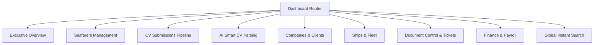
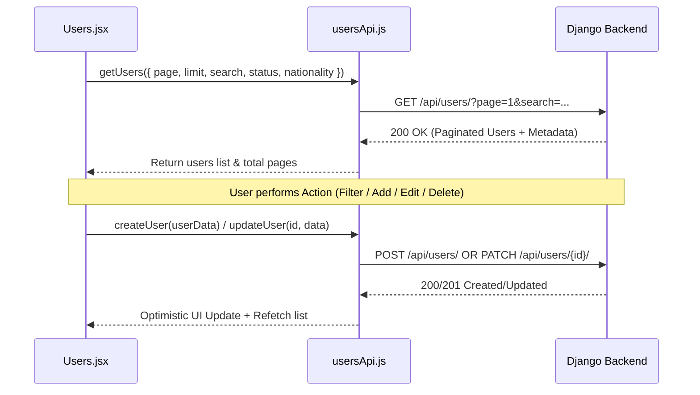
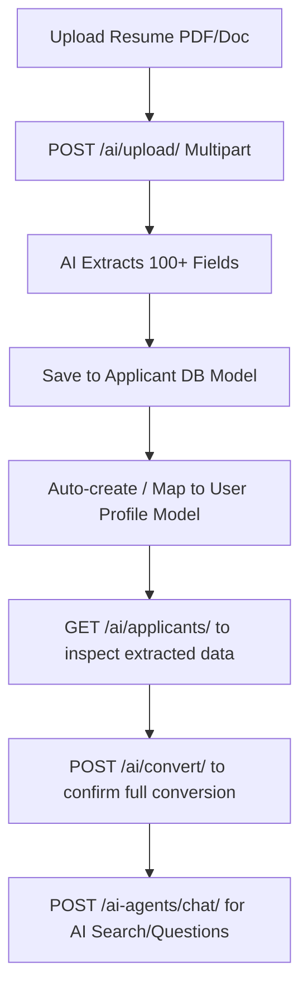
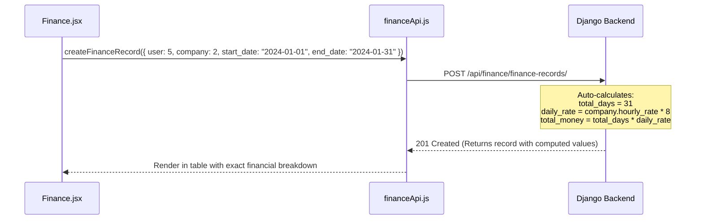

# 🚢 Sakr Manning Agency — Complete Screen-by-Screen API Connection Workflow Guide

This guide details the complete API interaction workflow for every screen in the Sakr Manning Agency web application. It is designed to streamline frontend-to-backend integration, standardizing data fetching, state updates, error handling, and payload schemas.

---

## 🏗️ 1. Core Architecture & Global API Handling

### 1.1 Centralized Axios Client (`api.js`)
All API calls pass through a centralized Axios instance configured with base URL, timeout, request interceptors (JWT injection), and response interceptors (auto token refresh on `401 Unauthorized`).

```javascript
// Base Config: config.API_BASE_URL (e.g., http://localhost:8000/api)
// Headers: Authorization: Bearer <access_token>
```

### 1.2 Global Authentication & Token Lifecycles
- **Access Token Expiration**: Automatically triggers a token refresh using `POST /api/login/refresh/` with `{ refresh: refreshToken }`.
- **Session Failure**: Clears storage and redirects to `/auth` if the refresh token expires or is invalid.

---

## 🔑 2. Authentication & Public Gateway Screens

### 2.1 Screen: Login & Authentication Portal (`/auth`)

#### 🔹 Workflow & API Flow

```mermaid
graph TD
    A[User Enters Credentials] --> B[POST /api/login/]
    B -->|Success| C[Store access & refresh tokens]
    C --> D[Parallel Fetch: GET /api/users/{id} & GET /api/users/me/]
    D --> E{User Role?}
    E -->|Admin / Administrator| F[Navigate to /dashboard]
    E -->|Seafarer / User| G[Navigate to /quick-apply or /form]
    B -->|Failure| H[Trigger Toast Error Auto-dismiss 4s]
```

#### 🔹 API Endpoints & Contracts

1. **User Login**
   - **Endpoint**: `POST /api/login/`
   - **Payload**:
     ```json
     {
       "email": "user@example.com",
       "password": "SecurePassword123!"
     }
     ```
   - **Response**:
     ```json
     {
       "access": "eyJ0eXAi...",
       "refresh": "eyJ0eXAi..."
     }
     ```

2. **Fetch Active User Profile & Role**
   - **Endpoint**: `GET /api/users/me/` & `GET /api/users/{user_id}/`
   - **Response Handling**: Merges responses to format current user state in `tokenStorage`.

3. **User Sign Up**
   - **Endpoint**: `POST /api/register/`
   - **Payload**:
     ```json
     {
       "email": "seafarer@example.com",
       "password": "Password123!",
       "first_name": "Ahmed"
     }
     ```

4. **Verification / OTP Code (Optional)**
   - **Endpoint**: `POST /auth/verify-code/`
   - **Payload**: `{ "email": "user@example.com", "code": "123456" }`

---

## 📝 3. Seafarer Profile & Registration Portal (`/form` - SakrForm)

The Seafarer Application Portal consists of 10 structured form tabs. All tabs share a persistent `userId` retrieved from authentication state.

```mermaid
graph LR
    Tab1[1. Personal Info] --> Tab2[2. Next of Kin]
    Tab2 --> Tab3[3. Documents]
    Tab3 --> Tab4[4. Medical/Vaccines]
    Tab4 --> Tab5[5. STCW Courses]
    Tab5 --> Tab6[6. Licenses/COC]
    Tab6 --> Tab7[7. Sea Service]
    Tab7 --> Tab8[8. Languages]
    Tab8 --> Tab9[9. References]
    Tab9 --> Tab10[10. Declarations & Submit]
```



### 3.1 Tab 1: Personal Information (`userService.js`)
- **Mount Flow**: `GET /api/users/{userId}/` → Populates personal details (Name, DOB, Nationality, Marital Status, Passport Details, Address, Phone).
- **Save/Update Flow**: `PATCH /api/users/{userId}/`
- **Payload Schema**:
  ```json
  {
    "first_name": "Mohamed",
    "last_name": "Ali",
    "nationality": "Egyptian",
    "marital_status": "MARRIED",
    "phone": "+201000000000",
    "passport_number": "A12345678",
    "passport_expiry": "2030-12-31"
  }
  ```

### 3.2 Tab 2: Next of Kin & Emergency Contacts (`nextOfKinService.js`)
- **Mount Flow**: `GET /api/users/{userId}/next-of-kin/`
- **Create/Update Flow**: `POST /api/users/{userId}/next-of-kin/` or `PUT /api/next-of-kin/{id}/`
- **Delete Flow**: `DELETE /api/next-of-kin/{id}/`
- **Payload Schema**:
  ```json
  {
    "full_name": "Fatima Ali",
    "relationship": "Spouse",
    "phone": "+201011111111",
    "address": "Alexandria, Egypt"
  }
  ```

### 3.3 Tab 3: Travel Documents & Passports (`documentService.js`)
- **Mount Flow**: `GET /api/users/{userId}/documents/`
- **Upload Flow**: `POST /api/users/{userId}/documents/` (Requires `Multipart/Form-Data`)
- **Payload Schema**:
  - `document_type`: "PASSPORT" | "SEAMAN_BOOK" | "YELLOW_FEVER"
  - `document_number`: "N123456"
  - `file`: `File` (Binary upload)
  - `expiry_date`: "2028-05-15"

### 3.4 Tab 4: Medical Certificates & Vaccinations (`vaccinationService.js`)
- **Mount Flow**: `GET /api/users/{userId}/vaccinations/`
- **Save Flow**: `POST /api/users/{userId}/vaccinations/`
- **Payload Schema**:
  ```json
  {
    "vaccine_name": "Yellow Fever",
    "issue_date": "2023-01-10",
    "expiry_date": "2033-01-10",
    "clinic_name": "Maritime Health Center"
  }
  ```

### 3.5 Tab 5: STCW Safety & Training Courses (`courseService.js`)
- **Reference Data Fetch**: `GET /api/certificates/` (Fetches list of STCW certificates)
- **User STCW Fetch**: `GET /api/users/{userId}/certificates/`
- **Add STCW Course**: `POST /api/users/{userId}/certificates/add/`
- **Payload Schema**: `{ "certificate_id": 14, "issue_date": "2022-04-01", "expiry_date": "2027-04-01" }`

### 3.6 Tab 6: Licenses & Certificates of Competency (`licenseService.js`)
- **Reference Data Fetch**: `GET /api/ranks/` (51 Maritime ranks)
- **User License Fetch**: `GET /api/users/{userId}/licenses/`
- **Save License**: `POST /api/users/{userId}/licenses/`
- **Payload Schema**:
  ```json
  {
    "rank_id": 3,
    "grade": "Chief Engineer Class 1",
    "issuing_country": "Egypt",
    "expiry_date": "2029-08-20"
  }
  ```

### 3.7 Tab 7: Sea Service Experience History (`seaServiceService.js`)
- **Mount Flow**: `GET /api/users/{userId}/sea-services/`
- **Create Entry**: `POST /api/users/{userId}/sea-services/`
- **Payload Schema**:
  ```json
  {
    "vessel_name": "MV Sakr Pride",
    "vessel_type": "Container Ship",
    "rank": "2nd Officer",
    "sign_on": "2023-01-15",
    "sign_off": "2023-07-15",
    "company_name": "Manning International"
  }
  ```

### 3.8 Tab 8: Language Proficiency (`languageService.js`)
- **Mount Flow**: `GET /api/users/{userId}/languages/`
- **Save Flow**: `POST /api/users/{userId}/languages/`
- **Payload Schema**: `{ "language": "English", "proficiency": "Fluent", "certification": "MARLINS" }`

### 3.9 Tab 9: Character References (`referenceService.js`)
- **Mount Flow**: `GET /api/users/{userId}/references/`
- **Save Flow**: `POST /api/users/{userId}/references/`

### 3.10 Tab 10: Final Review & Submission (`declarationService.js`)
- **Submit Flow**: `POST /api/users/{userId}/submit-application/`
- **Status Patch**: Updates status to `PENDING_VERIFICATION` or `ACTIVE`.

---

## 📊 4. Admin Dashboard Control Panel (`/dashboard`)

The Admin Dashboard provides comprehensive control over seafarers, fleet, clients, financials, and AI operations.



---

### 4.1 Executive Overview Screen (`Overview.jsx`)
- **Primary Purpose**: High-level agency metrics, active contracts, upcoming document expiries, crew on site vs. on vacation.
- **Mount Fetch**: Parallel API Calls
  - `GET /api/users/` (Total seafarers count)
  - `GET /api/contracts/` (Active contracts)
  - `GET /api/ships/` (Active ships count)
  - `GET /api/companies/` (Active company clients)
- **Aggregation Pattern**: The frontend hook computes active counts, expiring documents in 30 days, and active crew ratios.

---

### 4.2 Seafarers Management Screen (`Users.jsx`)

#### 🔹 API Workflow Connection Diagram



#### 🔹 Endpoints & Payloads
- **Fetch Users with Filtering & Pagination**:
  - **Endpoint**: `GET /api/users/` or `GET /api/filter/?nationality=Egypt&user_status=ON_SITE`
  - **Parameters**: `page`, `page_size`, `search`, `nationality`, `user_status` (`ON_SITE`, `VECATION`, `MEDICAL VECATION`).
- **Create Seafarer Profile**: `POST /api/users/`
- **Update Seafarer Profile**: `PATCH /api/users/{id}/`
- **Delete Seafarer Profile**: `DELETE /api/users/{id}/`
- **Assign Rank**: `POST /api/users/{id}/ranks/add/` (Auto-generates sequential rank codes e.g. `DO-1.001`).
- **Assign STCW Certificate**: `POST /api/users/{id}/certificates/add/`

---

### 4.3 CV Submissions & Recruitment Pipeline (`CVSubmissions.jsx`)
- **Primary Purpose**: Review incoming applicant resumes, filter by rank, and change candidate application status.
- **Mount Fetch**: `GET /api/cv-submissions/`
- **Filter Parameters**: `rank`, `status` (`NEW`, `REVIEWED`, `SHORTLISTED`, `REJECTED`, `HIRED`).
- **Status Change Flow**: `PATCH /api/cv-submissions/{id}/` with payload `{ "status": "SHORTLISTED" }`.

---

### 4.4 AI Smart CV Extraction & Automation (`AIApplication.jsx`)

#### 🔹 Workflow Pattern



#### 🔹 Key Endpoints & Payloads
1. **Upload Resume**:
   - **Endpoint**: `POST /ai/upload/`
   - **Headers**: `Content-Type: multipart/form-data`
   - **Body**: `file: File`, optional `save_to_db=true|false`
   - **Response**: Full extracted CV in 12-section numbered format
   - **Full reference**: see [`docs/ai-upload-api.md`](./ai-upload-api.md) (response shape, error codes, routing, OCR behavior, frontend integration notes)

2. **List AI Applicants**:
   - **Endpoint**: `GET /ai/applicants/`

3. **Convert Applicant to Registered User**:
   - **Endpoint**: `POST /ai/convert/`
   - **Body**: `{ "applicant_id": 25 }`

4. **AI Query Agent**:
   - **Endpoint**: `POST /ai-agents/chat/`
   - **Body**: `{ "query": "Find all Chief Engineers with valid Yellow Fever vaccine and 5+ years experience" }`

---

### 4.5 Companies & Clients Management Screen (`Company.jsx`)
- **Mount Fetch**: `GET /api/companies/`
- **Create Company**: `POST /api/companies/`
  - **Payload**:
    ```json
    {
      "company_name": "Oceanic Shipping Lines",
      "company_type": "Shipping",
      "contact_person": "Capt. Hany",
      "email": "hany@oceanic.com",
      "phone": "+201200000000",
      "hourly_rate": "25.00"
    }
    ```
- **Update Company**: `PUT/PATCH /api/companies/{id}/`
- **Delete Company**: `DELETE /api/companies/{id}/`

---

### 4.6 Fleet & Ships Management Screen (`shipsApi.js` / Inside Company Portal)
- **Mount Fetch**: `GET /api/ships/`
- **Create Ship**: `POST /api/ships/`
  - **Payload**:
    ```json
    {
      "ship_name": "M/V Sakr Star",
      "imo_number": "9123456",
      "company": 2,
      "flag": "Panama",
      "vessel_type": "Container",
      "gross_tonnage": 45000,
      "engine_power": "12000 kW"
    }
    ```
- **Update Ship**: `PATCH /api/ships/{id}/`
- **Delete Ship**: `DELETE /api/ships/{id}/`

---

### 4.7 Documents Control & Travel Papers (`Documents.jsx`)
- **Manage Flight Tickets**:
  - `GET /api/tickets-papers/tickets/`
  - `POST /api/tickets-papers/tickets/` (Multipart file upload)
- **Manage Traveling Papers & Visas**:
  - `GET /api/tickets-papers/traveling-papers/`
  - `POST /api/tickets-papers/traveling-papers/`

---

### 4.8 Interviews Scheduling & Tracking (`Interviews.jsx`)
- **Mount Fetch**: `GET /api/interviews/`
- **Schedule Interview**: `POST /api/interviews/`
  - **Payload**:
    ```json
    {
      "candidate_name": "Seafarer Name",
      "user_id": 12,
      "company_id": 2,
      "scheduled_date": "2026-08-01T10:00:00Z",
      "interviewer": "Capt. Hassan",
      "status": "Scheduled"
    }
    ```
- **Update Interview Result**: `PATCH /api/interviews/{id}/` (`Passed`, `Failed`, `Rescheduled`).

---

### 4.9 Job Vacancies & Demand Management (`JobVacancies.jsx`)
- **Mount Fetch**: `GET /api/job-vacancies/` & `GET /api/job-orders/`
- **Post Vacancy**: `POST /api/job-vacancies/`
  - **Payload**:
    ```json
    {
      "title": "Chief Officer Required",
      "company": 2,
      "vessel_type": "Oil Tanker",
      "rank_required": "Chief Officer",
      "salary": "6500 USD",
      "contract_duration": "4 Months"
    }
    ```

---

### 4.10 Finance & Crew Payroll Screen (`Finance.jsx`)

#### 🔹 Automatic Calculation Workflow
When creating a finance record, the backend automatically calculates total days, daily rate, and total payout based on company rates and contract dates!



- **Endpoints**:
  - `GET /api/finance/finance-records/`
  - `POST /api/finance/finance-records/`

---

### 4.11 Instant Global Search Component (`SearchResults.jsx`)
- **Endpoint**: `GET /api/global-search/?q={query}`
- **Response**:
  ```json
  {
    "seafarers": [ ... ],
    "ships": [ ... ],
    "companies": [ ... ],
    "documents": [ ... ]
  }
  ```

---

## 💡 5. Simplified Connection Checklist for Developers

To connect any new screen or component quickly without writing repetitive boilerplates:

1. **Import Central API Instance**:
   Use `import api from 'services/Auth/api';` or the domain service file (e.g., `usersApi.js`).
2. **Use Custom React Hooks for Data Hydration**:
   Wrap state in reusable hooks (e.g. `useFetchData(usersApi.getUsers, [page, search])`) with loading states and error toasts.
3. **Optimistic UI Updates**:
   For action buttons (e.g. status toggle or delete), update state locally first, then dispatch the API call. Revert on error.
4. **Multipart Headers for File Uploads**:
   Always pass `headers: { 'Content-Type': 'multipart/form-data' }` when appending files to `FormData()`.

---
